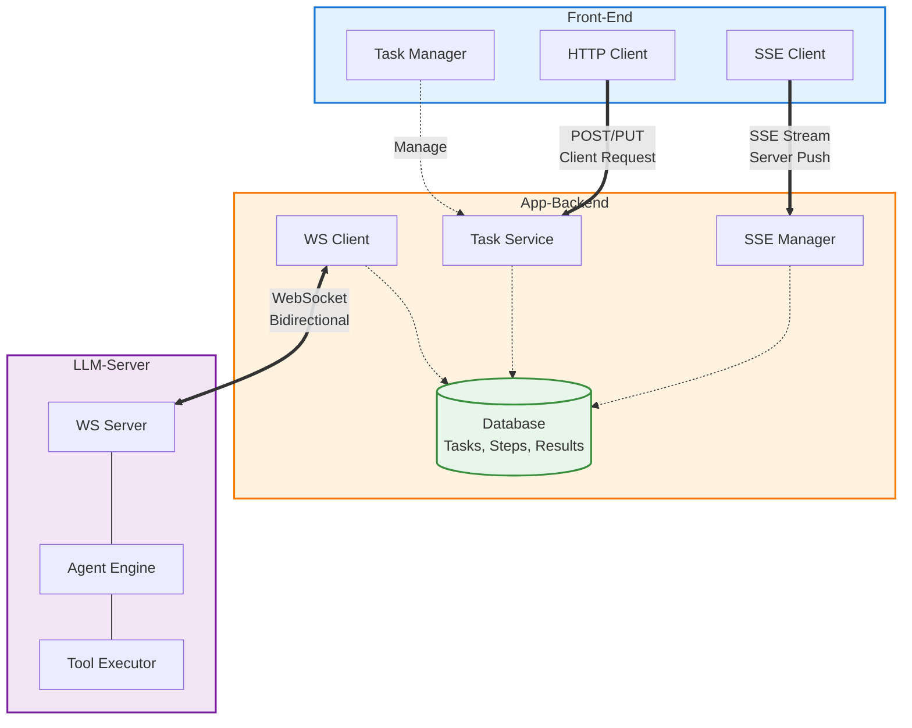

```mermaid
flowchart TB
    subgraph FE["Front-End"]
        direction LR
        SSE[SSE Client]
        HTTP[HTTP Client]
        TM[Task Manager]
    end
    
    subgraph BE["App-Backend"]
        direction TB
        SSEM[SSE Manager]
        TS[Task Service]
        WSC[WS Client]
        DB[(Database<br/>Tasks, Steps, Results)]
        
        SSEM -.-> DB
        TS -.-> DB
        WSC -.-> DB
    end
    
    subgraph LLM["LLM-Server"]
        direction LR
        WSS[WS Server]
        AE[Agent Engine]
        TE[Tool Executor]
        
        WSS --- AE
        AE --- TE
    end
    
    SSE ==>|SSE Stream<br/>Server Push| SSEM
    HTTP ==>|POST/PUT<br/>Client Request| TS
    TM -.->|Manage| TS
    
    WSC <==>|WebSocket<br/>Bidirectional| WSS
    
    style FE fill:#e3f2fd,stroke:#1976d2,stroke-width:2px
    style BE fill:#fff3e0,stroke:#f57c00,stroke-width:2px
    style LLM fill:#f3e5f5,stroke:#7b1fa2,stroke-width:2px
    style DB fill:#e8f5e9,stroke:#388e3c,stroke-width:2px
```