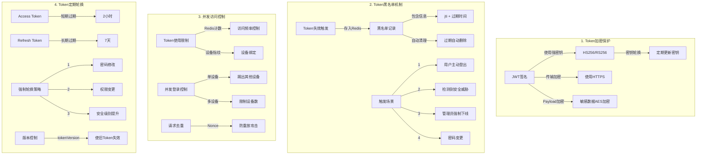

```mermaid
flowchart TD
    subgraph 加密保护[1. Token加密保护]
        A1[JWT签名] -->|使用强密钥| B1[HS256/RS256]
        B1 -->|密钥轮换| C1[定期更新密钥]
        A1 -->|传输加密| D1[使用HTTPS]
        A1 -->|Payload加密| E1[敏感数据AES加密]
    end

    subgraph 黑名单[2. Token黑名单机制]
        A2[Token失效触发] -->|存入Redis| B2[黑名单记录]
        B2 -->|包含信息| C2[jti + 过期时间]
        B2 -->|自动清理| D2[过期自动删除]
        
        E2[触发场景]
        E2 -->|1| F2[用户主动登出]
        E2 -->|2| G2[检测到安全威胁]
        E2 -->|3| H2[管理员强制下线]
        E2 -->|4| I2[密码变更]
    end

    subgraph 并发控制[3. 并发访问控制]
        A3[Token使用限制] -->|Redis计数| B3[访问频率控制]
        A3 -->|设备指纹| C3[设备绑定]
        
        D3[并发登录控制]
        D3 -->|单设备| E3[踢出其他设备]
        D3 -->|多设备| F3[限制设备数]
        
        G3[请求去重]
        G3 -->|Nonce| H3[防重放攻击]
    end

    subgraph Token轮换[4. Token定期轮换]
        A4[Access Token] -->|短期过期| B4[2小时]
        C4[Refresh Token] -->|长期过期| D4[7天]
        
        E4[强制轮换策略]
        E4 -->|1| F4[密码修改]
        E4 -->|2| G4[权限变更]
        E4 -->|3| H4[安全级别提升]
        
        I4[版本控制] -->|tokenVersion| J4[使旧Token失效]
    end
```