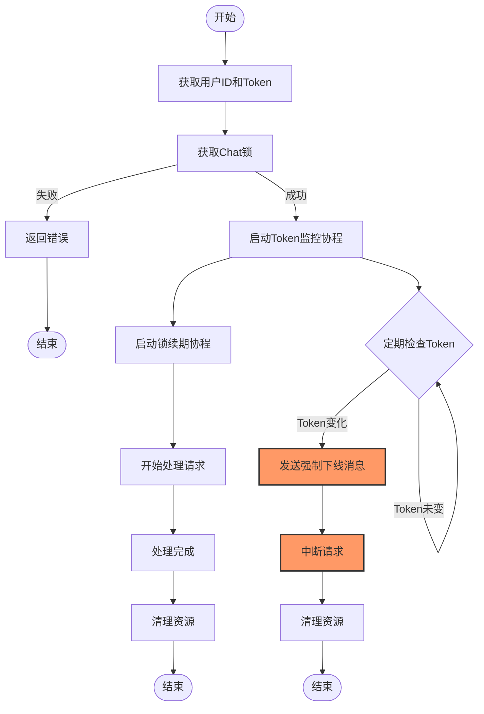

```mermaid
flowchart TD
    Start([开始]) --> A[获取用户ID和Token]
    A --> B[获取Chat锁]
    
    B -->|失败| C[返回错误]
    C --> End1([结束])
    
    B -->|成功| D[启动Token监控协程]
    D --> E[启动锁续期协程]
    E --> F[开始处理请求]
    
    D --> G{定期检查Token}
    G -->|Token变化| H[发送强制下线消息]
    H --> I[中断请求]
    I --> J[清理资源]
    J --> End2([结束])
    
    G -->|Token未变| G
    
    F --> K[处理完成]
    K --> L[清理资源]
    L --> End3([结束])
    
    style H fill:#f96,stroke:#333,stroke-width:2px
    style I fill:#f96,stroke:#333,stroke-width:2px
```