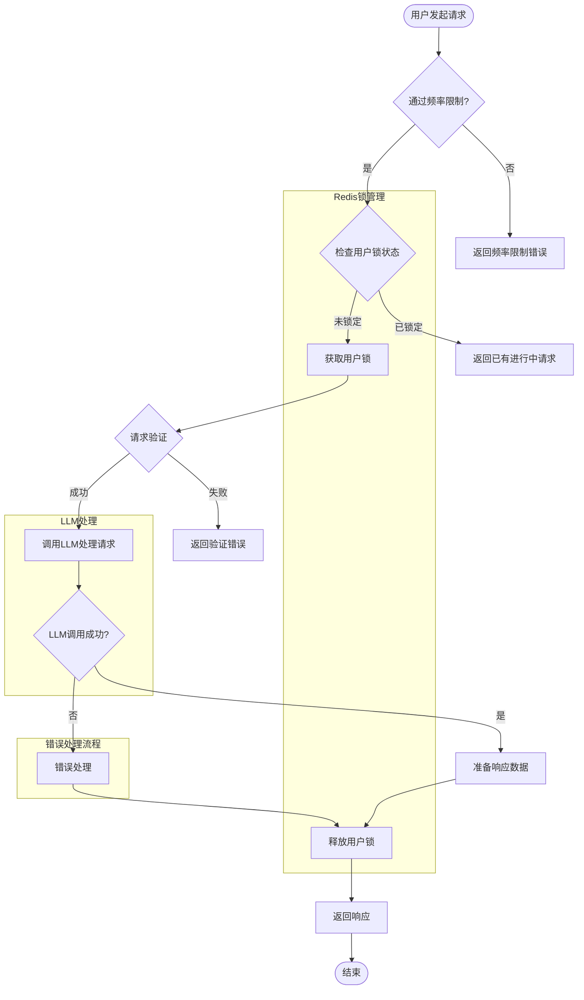

```mermaid
flowchart TD
    Start([用户发起请求]) --> RateLimit{通过频率限制?}
    RateLimit -- 否 --> RateError[返回频率限制错误]
    RateLimit -- 是 --> CheckLock{检查用户锁状态}
    
    CheckLock -- 已锁定 --> LockError[返回已有进行中请求]
    CheckLock -- 未锁定 --> AcquireLock[获取用户锁]
    
    AcquireLock --> ValidateReq{请求验证}
    ValidateReq -- 失败 --> ValidationError[返回验证错误]
    ValidateReq -- 成功 --> ProcessLLM[调用LLM处理请求]
    
    ProcessLLM --> LLMSuccess{LLM调用成功?}
    LLMSuccess -- 否 --> HandleError[错误处理]
    LLMSuccess -- 是 --> PrepareResponse[准备响应数据]
    
    HandleError --> ReleaseLock[释放用户锁]
    PrepareResponse --> ReleaseLock
    
    ReleaseLock --> SendResponse[返回响应]
    SendResponse --> End([结束])
    
    subgraph 错误处理流程
        HandleError
    end
    
    subgraph Redis锁管理
        CheckLock
        AcquireLock
        ReleaseLock
    end
    
    subgraph LLM处理
        ProcessLLM
        LLMSuccess
    end
```