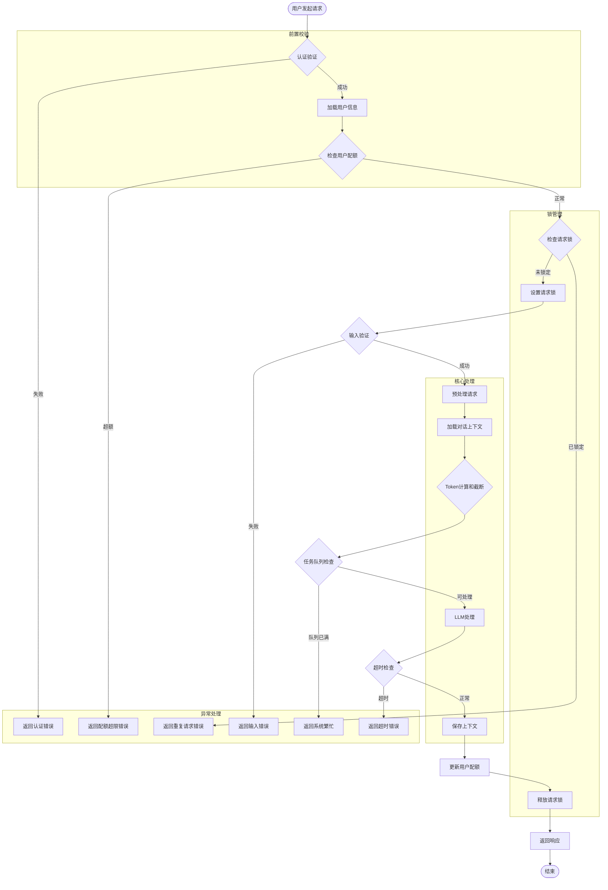

```mermaid
flowchart TD
    Start([用户发起请求]) --> Auth{认证验证}
    Auth -- 失败 --> AuthError[返回认证错误]
    Auth -- 成功 --> LoadUser[加载用户信息]
    
    LoadUser --> CheckQuota{检查用户配额}
    CheckQuota -- 超额 --> QuotaError[返回配额超限错误]
    CheckQuota -- 正常 --> CheckReqLock{检查请求锁}
    
    CheckReqLock -- 已锁定 --> ReqLockedError[返回重复请求错误]
    CheckReqLock -- 未锁定 --> SetReqLock[设置请求锁]
    
    SetReqLock --> ValidateInput{输入验证}
    ValidateInput -- 失败 --> InputError[返回输入错误]
    ValidateInput -- 成功 --> PreProcess[预处理请求]
    
    PreProcess --> LoadContext[加载对话上下文]
    LoadContext --> TokenCheck{Token计算和截断}
    TokenCheck --> Queue{任务队列检查}
    
    Queue -- 队列已满 --> QueueError[返回系统繁忙]
    Queue -- 可处理 --> ProcessLLM[LLM处理]
    
    ProcessLLM --> Timeout{超时检查}
    Timeout -- 超时 --> TimeoutError[返回超时错误]
    Timeout -- 正常 --> SaveContext[保存上下文]
    
    SaveContext --> UpdateQuota[更新用户配额]
    UpdateQuota --> ReleaseReqLock[释放请求锁]
    ReleaseReqLock --> Response[返回响应]
    Response --> End([结束])
    
    subgraph 前置校验
        Auth
        LoadUser
        CheckQuota
    end
    
    subgraph 锁管理
        CheckReqLock
        SetReqLock
        ReleaseReqLock
    end
    
    subgraph 核心处理
        PreProcess
        LoadContext
        TokenCheck
        ProcessLLM
        SaveContext
    end
    
    subgraph 异常处理
        AuthError
        QuotaError
        ReqLockedError
        InputError
        QueueError
        TimeoutError
    end
```