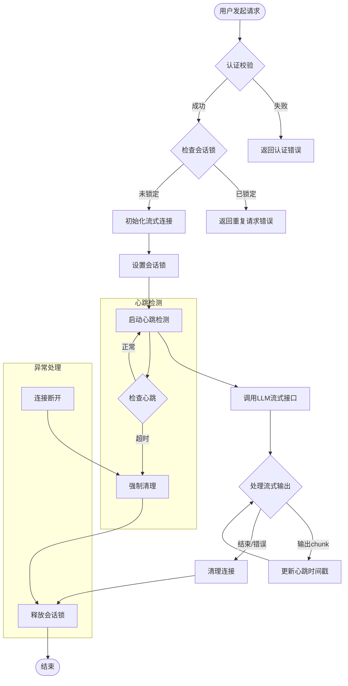

```mermaid
flowchart TD
    Start([用户发起请求]) --> Auth{认证校验}
    Auth -- 失败 --> AuthError[返回认证错误]
    Auth -- 成功 --> CheckLock{检查会话锁}
    
    CheckLock -- 已锁定 --> LockError[返回重复请求错误]
    CheckLock -- 未锁定 --> InitStream[初始化流式连接]
    
    InitStream --> SetLock[设置会话锁]
    SetLock --> WatchDog[启动心跳检测]
    
    WatchDog --> CallLLM[调用LLM流式接口]
    CallLLM --> StreamProcess{处理流式输出}
    
    StreamProcess -- 输出chunk --> UpdateHeartbeat[更新心跳时间戳]
    UpdateHeartbeat --> StreamProcess
    
    StreamProcess -- 结束/错误 --> CleanupConnection[清理连接]
    CleanupConnection --> ReleaseLock[释放会话锁]
    ReleaseLock --> End([结束])
    
    subgraph 心跳检测
        WatchDog --> CheckHeartbeat{检查心跳}
        CheckHeartbeat -- 超时 --> ForceCleanup[强制清理]
        CheckHeartbeat -- 正常 --> WatchDog
    end
    
    subgraph 异常处理
        ConnectionLost[连接断开] --> ForceCleanup
        ForceCleanup --> ReleaseLock
    end
```