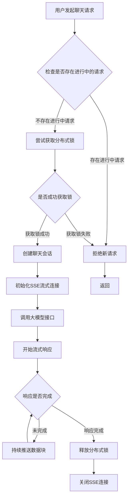

```mermaid
flowchart TD
    A[用户发起聊天请求] --> B{检查是否存在进行中的请求}
    B -->|存在进行中请求| C[拒绝新请求]
    B -->|不存在进行中请求| D[尝试获取分布式锁]
    
    D --> E{是否成功获取锁}
    E -->|获取锁成功| F[创建聊天会话]
    E -->|获取锁失败| C
    
    F --> G[初始化SSE流式连接]
    G --> H[调用大模型接口]
    H --> I[开始流式响应]
    
    I --> J{响应是否完成}
    J -->|未完成| K[持续推送数据块]
    K --> J
    
    J -->|响应完成| L[释放分布式锁]
    L --> M[关闭SSE连接]
    
    C --> N[返回]
```