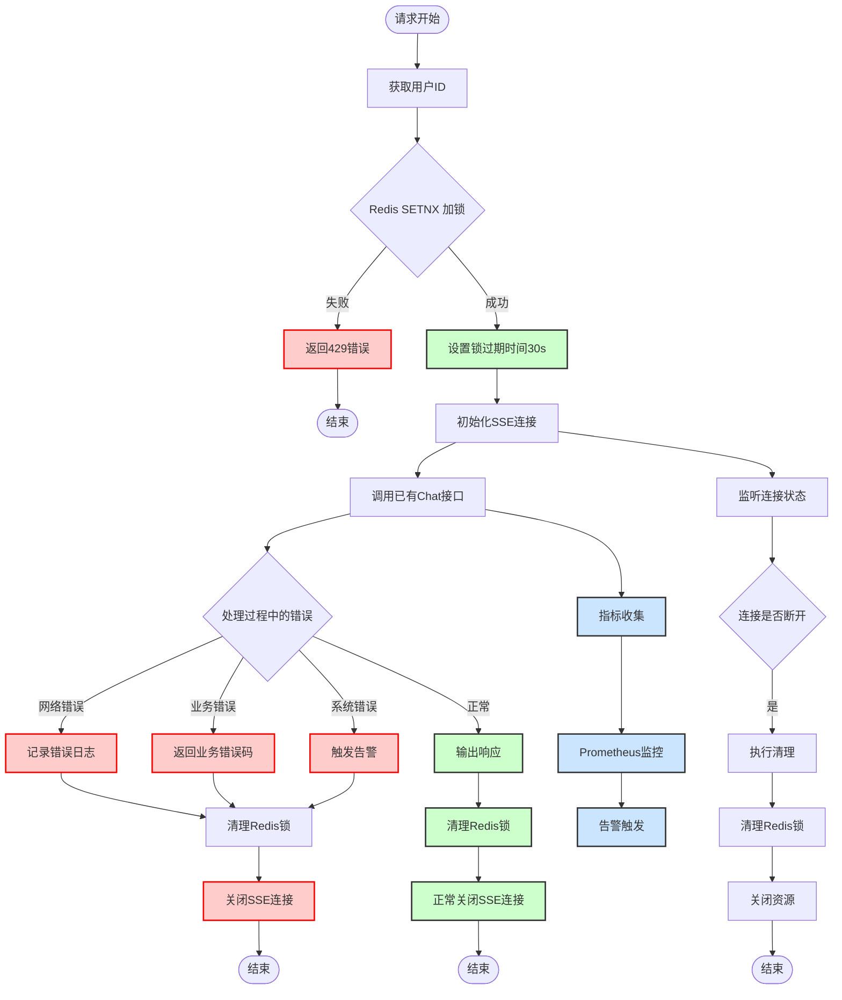

```mermaid
flowchart TD
    Start([请求开始]) --> A[获取用户ID]
    A --> B{Redis SETNX 加锁}
    
    %% 加锁失败流程
    B -->|失败| C[返回429错误]
    C --> End1([结束])
    
    %% 加锁成功流程
    B -->|成功| D[设置锁过期时间30s]
    D --> E[初始化SSE连接]
    
    %% 主处理流程
    E --> F[调用已有Chat接口]
    
    %% 错误处理分支
    F --> G{处理过程中的错误}
    G -->|网络错误| H1[记录错误日志]
    G -->|业务错误| H2[返回业务错误码]
    G -->|系统错误| H3[触发告警]
    H1 --> I[清理Redis锁]
    H2 --> I
    H3 --> I
    I --> J[关闭SSE连接]
    J --> End2([结束])
    
    %% 正常处理分支
    G -->|正常| K[输出响应]
    K --> L[清理Redis锁]
    L --> M[正常关闭SSE连接]
    M --> End3([结束])
    
    %% 连接断开处理
    E --> N[监听连接状态]
    N --> O{连接是否断开}
    O -->|是| P[执行清理]
    P --> Q[清理Redis锁]
    Q --> R[关闭资源]
    R --> End4([结束])
    
    %% 系统监控
    F --> S[指标收集]
    S --> T[Prometheus监控]
    T --> U[告警触发]
    
    %% 样式
    classDef error fill:#ffcccc,stroke:#ff0000,stroke-width:2px
    classDef normal fill:#ccffcc,stroke:#333,stroke-width:2px
    classDef monitor fill:#cce5ff,stroke:#333,stroke-width:2px
    
    class C,H1,H2,H3,J error
    class D,K,L,M normal
    class S,T,U monitor
```