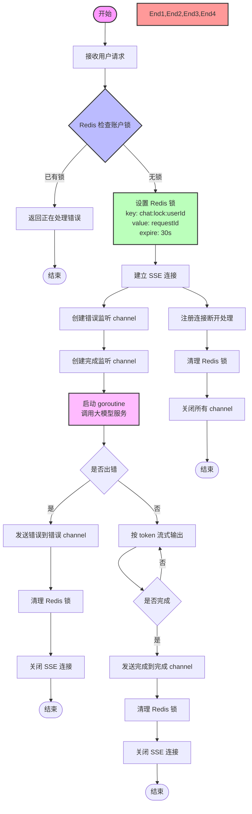

```mermaid
flowchart TD
    Start([开始]) --> A[接收用户请求]
    A --> B{Redis 检查账户锁}
    
    B -->|已有锁| C[返回正在处理错误]
    C --> End1([结束])
    
    B -->|无锁| D[设置 Redis 锁<br>key: chat:lock:userId<br>value: requestId<br>expire: 30s]
    D --> E[建立 SSE 连接]
    
    E --> F[创建错误监听 channel]
    F --> G[创建完成监听 channel]
    G --> H[启动 goroutine<br>调用大模型服务]
    
    H --> I{是否出错}
    I -->|是| J[发送错误到错误 channel]
    J --> K[清理 Redis 锁]
    K --> L[关闭 SSE 连接]
    L --> End2([结束])
    
    I -->|否| M[按 token 流式输出]
    M --> N{是否完成}
    N -->|否| M
    N -->|是| O[发送完成到完成 channel]
    O --> P[清理 Redis 锁]
    P --> Q[关闭 SSE 连接]
    Q --> End3([结束])
    
    %% 连接断开处理
    E --> R[注册连接断开处理]
    R --> S[清理 Redis 锁]
    S --> T[关闭所有 channel]
    T --> End4([结束])
    
    style Start fill:#f9f,stroke:#333,stroke-width:2px
    style End1,End2,End3,End4 fill:#f99,stroke:#333,stroke-width:2px
    style B fill:#bbf,stroke:#333,stroke-width:2px
    style D fill:#bfb,stroke:#333,stroke-width:2px
    style H fill:#fbf,stroke:#333,stroke-width:2px
```