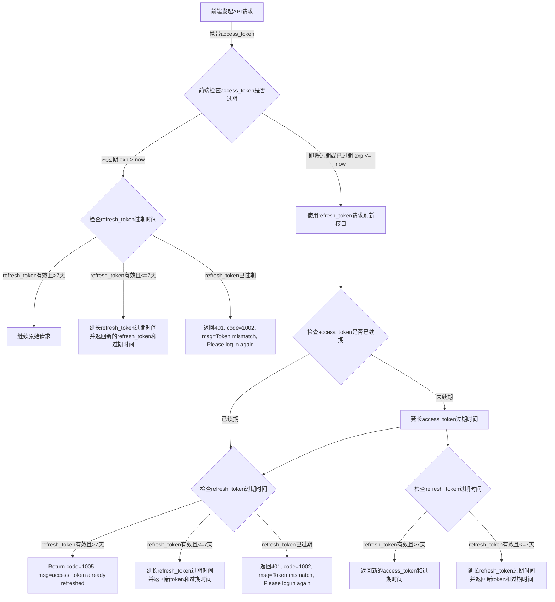

```mermaid
flowchart TD
    A[前端发起API请求] -->|携带access_token| B{前端检查access_token是否过期}
    B -->|未过期 exp > now| C{检查refresh_token过期时间}
    B -->|即将过期或已过期 exp <= now| D[使用refresh_token请求刷新接口]
    C -->|refresh_token有效且>7天| E[继续原始请求]
    C -->|refresh_token有效且<=7天| F[延长refresh_token过期时间并返回新的refresh_token和过期时间]
    C -->|refresh_token已过期| G[返回401, code=1002, msg=Token mismatch, Please log in again]
    D --> H{检查access_token是否已续期}
    H -->|已续期| I{检查refresh_token过期时间}
    H -->|未续期| J[延长access_token过期时间] --> I
    I -->|refresh_token有效且>7天| K[Return code=1005, msg=access_token already refreshed]
    I -->|refresh_token有效且<=7天| L[延长refresh_token过期时间并返回新token和过期时间]
    I -->|refresh_token已过期| M[返回401, code=1002, msg=Token mismatch, Please log in again]
    J --> N{检查refresh_token过期时间}
    N -->|refresh_token有效且>7天| O[返回新的access_token和过期时间]
    N -->|refresh_token有效且<=7天| P[延长refresh_token过期时间并返回新token和过期时间]

```