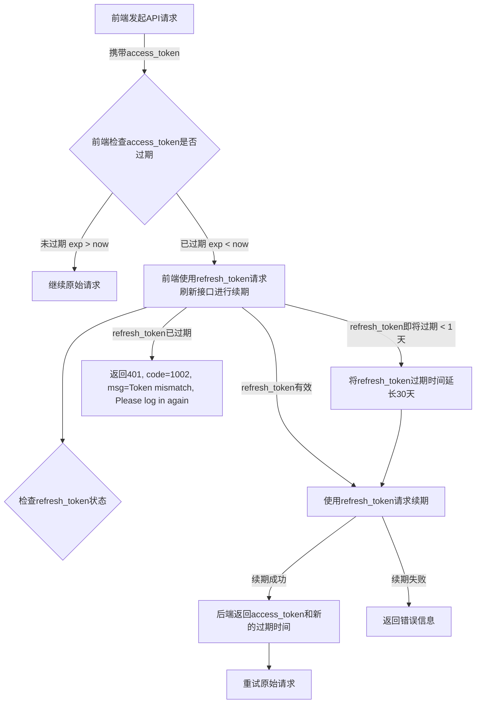

```mermaid
flowchart TD
    A[前端发起API请求] -->|携带access_token| B{前端检查access_token是否过期}
    B -->|未过期 exp > now| C[继续原始请求]
    B -->|已过期 exp < now| D[前端使用refresh_token请求刷新接口进行续期]
    D ---> L{检查refresh_token状态}
    D -->|refresh_token即将过期 < 1天| E[将refresh_token过期时间延长30天]
    D -->|refresh_token已过期| F[返回401, code=1002, msg=Token mismatch, Please log in again]
    D -->|refresh_token有效| G[使用refresh_token请求续期]
    G -->|续期成功| H[后端返回access_token和新的过期时间]
    G -->|续期失败| I[返回错误信息]
    H --> J[重试原始请求]
    E --> G

```