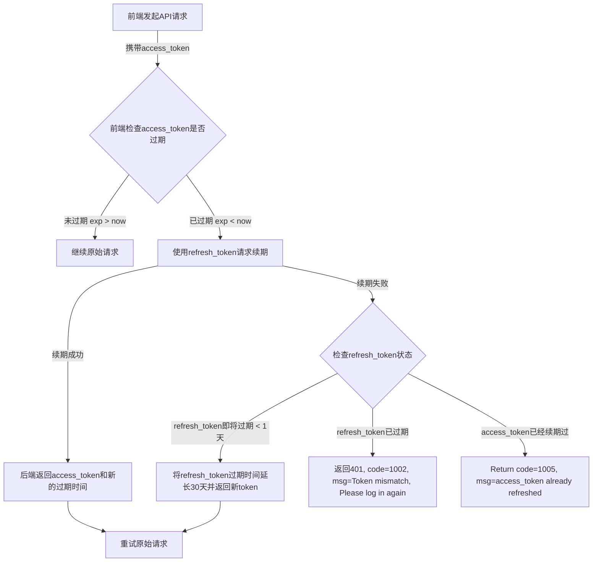

```mermaid
flowchart TD
    A[前端发起API请求] -->|携带access_token| B{前端检查access_token是否过期}
    B -->|未过期 exp > now| C[继续原始请求]
    B -->|已过期 exp < now| D[使用refresh_token请求续期]
    D -->|续期成功| E[后端返回access_token和新的过期时间]
    D -->|续期失败| F{检查refresh_token状态}
    F -->|refresh_token即将过期 < 1天| G[将refresh_token过期时间延长30天并返回新token]
    F -->|refresh_token已过期| H[返回401, code=1002, msg=Token mismatch, Please log in again]
    F -->|access_token已经续期过| I[Return code=1005, msg=access_token already refreshed]
    E --> J[重试原始请求]
    G --> J[重试原始请求]

```