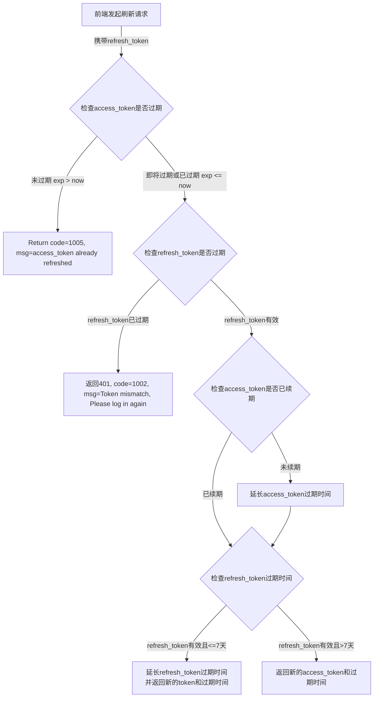

```mermaid
flowchart TD
    A[前端发起刷新请求] -->|携带refresh_token| B{检查access_token是否过期}
    B -->|未过期 exp > now| C[Return code=1005, msg=access_token already refreshed]
    B -->|即将过期或已过期 exp <= now| D{检查refresh_token是否过期}
    D -->|refresh_token已过期| E[返回401, code=1002, msg=Token mismatch, Please log in again]
    D -->|refresh_token有效| F{检查access_token是否已续期}
    F -->|已续期| G{检查refresh_token过期时间}
    F -->|未续期| H[延长access_token过期时间] --> G
    G -->|refresh_token有效且<=7天| I[延长refresh_token过期时间并返回新的token和过期时间]
    G -->|refresh_token有效且>7天| J[返回新的access_token和过期时间]

```