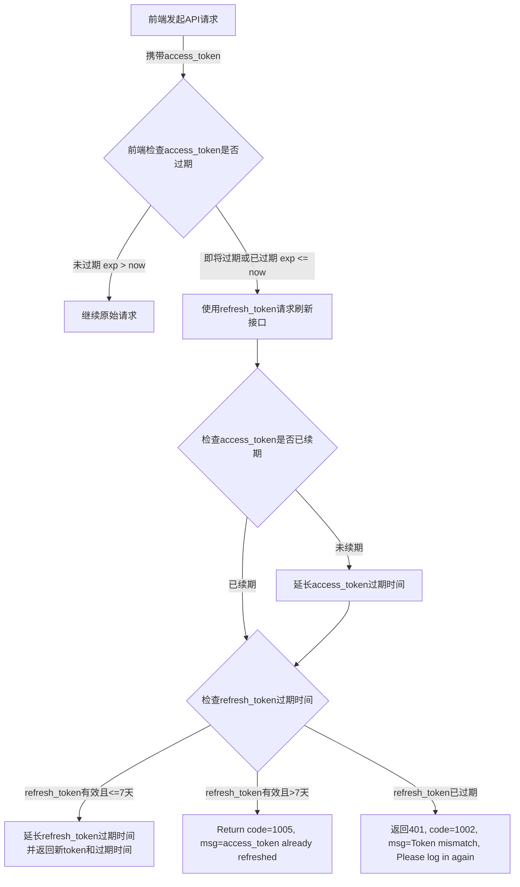

```mermaid
flowchart TD
    A[前端发起API请求] -->|携带access_token| B{前端检查access_token是否过期}
    B -->|未过期 exp > now| C[继续原始请求]
    B -->|即将过期或已过期 exp <= now| D[使用refresh_token请求刷新接口]
    D --> E{检查access_token是否已续期}
    E -->|已续期| F{检查refresh_token过期时间}
    E -->|未续期| G[延长access_token过期时间] --> F
    F -->|refresh_token有效且<=7天| H[延长refresh_token过期时间并返回新token和过期时间]
    F -->|refresh_token有效且>7天| I[Return code=1005, msg=access_token already refreshed]
    F -->|refresh_token已过期| J[返回401, code=1002, msg=Token mismatch, Please log in again]

```