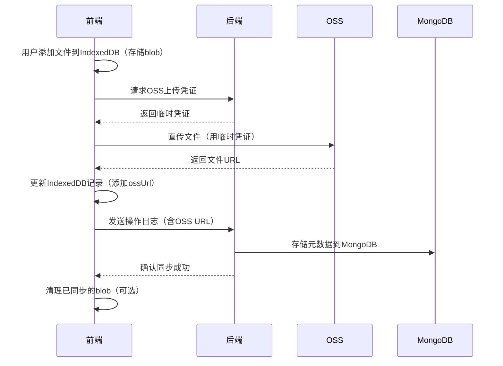

```mermaid
sequenceDiagram
    participant F as 前端
    participant S as 后端
    participant O as OSS
    participant M as MongoDB

    F->>F: 用户添加文件到IndexedDB（存储blob）
    F->>S: 请求OSS上传凭证
    S-->>F: 返回临时凭证
    F->>O: 直传文件（用临时凭证）
    O-->>F: 返回文件URL
    F->>F: 更新IndexedDB记录（添加ossUrl）
    F->>S: 发送操作日志（含OSS URL）
    S->>M: 存储元数据到MongoDB
    S-->>F: 确认同步成功
    F->>F: 清理已同步的blob（可选）
```