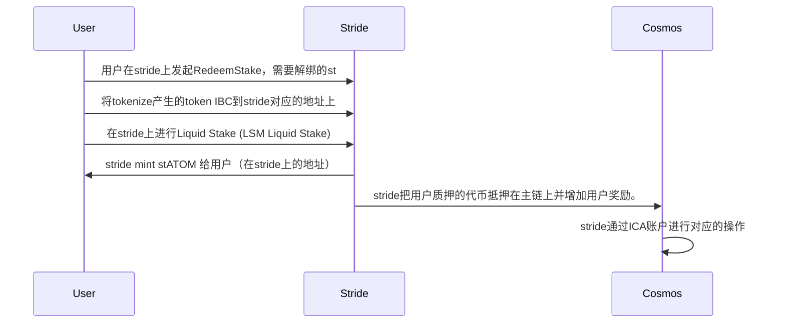

```mermaid
sequenceDiagram
    User->>Stride: 用户在stride上发起RedeemStake，需要解绑的st
    User->>Stride: 将tokenize产生的token IBC到stride对应的地址上
    User->>Stride: 在stride上进行Liquid Stake (LSM Liquid Stake)
    Stride->>User: stride mint stATOM 给用户（在stride上的地址）
    Stride->>Cosmos: stride把用户质押的代币抵押在主链上并增加用户奖励。
    Cosmos->>Cosmos: stride通过ICA账户进行对应的操作
```