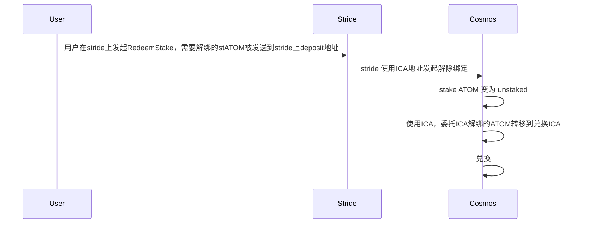

```mermaid
sequenceDiagram
    User->>Stride: 用户在stride上发起RedeemStake，需要解绑的stATOM被发送到stride上deposit地址
    Stride->>Cosmos: stride 使用ICA地址发起解除绑定
    Cosmos->>Cosmos: stake ATOM 变为 unstaked
    Cosmos->>Cosmos: 使用ICA，委托ICA解绑的ATOM转移到兑换ICA
    Cosmos->>Cosmos: 兑换
```