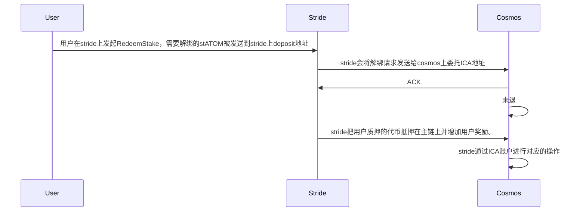

```mermaid
sequenceDiagram
    User->>Stride: 用户在stride上发起RedeemStake，需要解绑的stATOM被发送到stride上deposit地址
    Stride->>Cosmos: stride会将解绑请求发送给cosmos上委托ICA地址
    Cosmos->>Stride: ACK
    Cosmos->>Cosmos: 未退
    Stride->>Cosmos: stride把用户质押的代币抵押在主链上并增加用户奖励。
    Cosmos->>Cosmos: stride通过ICA账户进行对应的操作
```