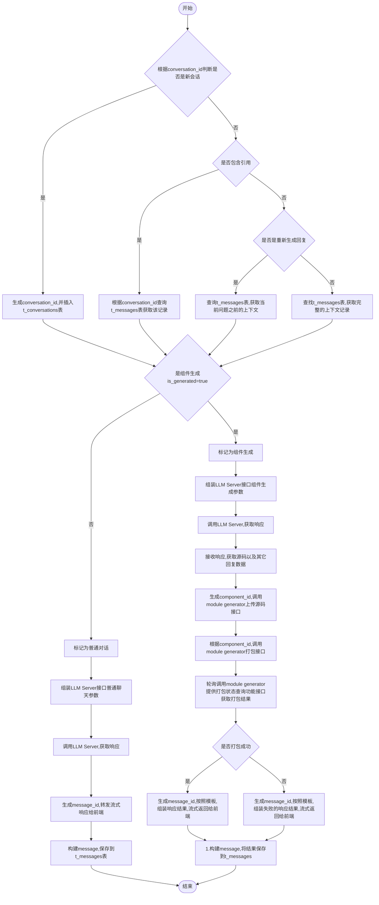

```mermaid
flowchart TD
    A([开始]) --> B{根据conversation_id判断是否是新会话}
    B -- 是 --> C[生成conversation_id,并插入t_conversations表]
    B -- 否 --> D{是否包含引用}
    D -- 是 --> E[根据conversation_id查询t_messages表获取该记录]
    D -- 否 --> F{是否是重新生成回复}
    F -- 是 --> G[查询t_messages表,获取当前问题之前的上下文]
    F -- 否 --> H[查找t_messages表,获取完整的上下文记录]
     
    C & E & G & H --> I{是组件生成is_generated=true}
    I -- 是 --> J[标记为组件生成]
    I -- 否 --> K[标记为普通对话]

    J --> L[组装LLM Server接口组件生成参数]    
    K --> M[组装LLM Server接口普通聊天参数]    
    M --> N[调用LLM Server,获取响应]    
    N --> O[生成message_id,转发流式响应给前端]
    O --> P[构建message,保存到t_messages表]
    P --> R([结束])


    L --> S[调用LLM Server,获取响应]
    S --> T[接收响应,获取源码以及其它回复数据]
    T --> U[生成component_id,调用module generator上传源码接口]
    U --> V[根据component_id,调用module generator打包接口]
    V --> W[轮询调用module generator提供打包状态查询功能接口获取打包结果]
    W --> X{是否打包成功}
    X -- 是 --> Y[生成message_id,按照模板,组装响应结果,流式返回给前端]
    X -- 否 --> Z[生成message_id,按照模板,组装失败的响应结果,流式返回给前端]

    Y & Z --> Result[1.构建message,将结果保存到t_messages ]
    Result --> R
```