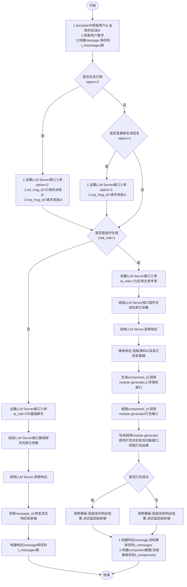

```mermaid
flowchart TD
    A([开始]) --> B[1.从cookie中获取用户id,当前的会话id \n 2.获取用户需求 \n 3.构建message,保存到t_messsages表]
    B--> D{是否包含引用 \n option=2}
    D -- 是 --> E[1.设置LLM Server接口入参option=2 \n 2.ref_msg_id=引用的消息id \n 3.req_msg_id=请求消息id]
    D -- 否 --> F{是否是重新生成回复\n option=1}
    F -- 是 --> G[1.设置LLM Server接口入参option=1 \n 2.req_msg_id=请求消息id]
    F -- 否 --> I
     
    E & G --> I{是否是组件生成 \n chat_role=1}
    I -- 否 --> K[设置LLM Server接口入参ai_role=0为基础聊天]
    I -- 是 --> J[设置LLM Server接口入参ai_role=1为应用生成专家]
    

    J --> L[组装LLM Server接口组件生成的其它参数]    
    K --> M[组装LLM Server接口基础聊天的其它参数]    
    M --> N[调用LLM Server,获取响应]    
    N --> O[获取message_id,转发流式响应给前端]
    O --> P[构建响应message保存到t_messages表]
    P --> R([结束])


    L --> S[调用LLM Server,获取响应]
    S --> T[接收响应,获取源码以及其它回复数据]
    T --> U[生成component_id,调用module generator上传源码接口]
    U --> V[根据component_id,调用module generator打包接口]
    V --> W[轮询调用module generator提供打包状态查询功能接口获取打包结果]
    W --> X{是否打包成功}
    X -- 是 --> Y[按照模板,组装成功响应结果,流式返回给前端]
    X -- 否 --> Z[按照模板,组装失败响应结果,流式返回给前端]

    Y & Z --> Result[1.构建响应message,将结果保存到t_messages \n 2.构建component数据,将结果保存到t_components]
    Result --> R
```