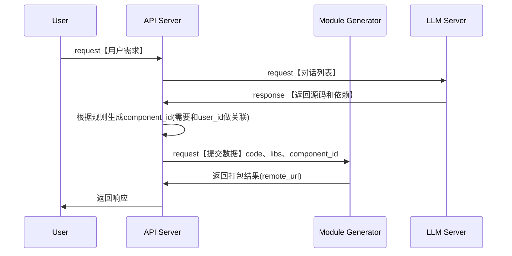

```mermaid
sequenceDiagram
    participant User
    participant API Server
    participant Module Generator
    participant LLM Server

    User->>API Server: request【用户需求】
    API Server->>LLM Server: request【对话列表】
    LLM Server->>API Server: response 【返回源码和依赖】
    API Server->>API Server: 根据规则生成component_id(需要和user_id做关联)
    API Server->>Module Generator: request【提交数据】code、libs、component_id
    Module Generator->>API Server: 返回打包结果(remote_url)
    
    API Server->>User: 返回响应
```