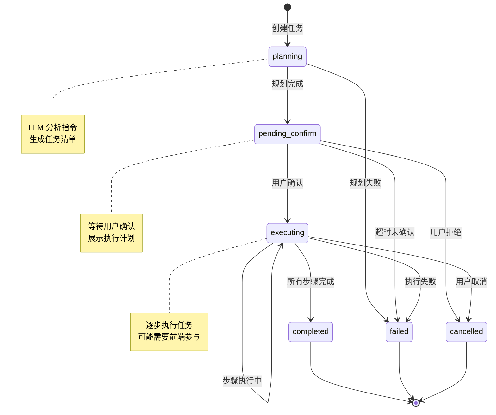

```mermaid
stateDiagram-v2
    [*] --> planning: 创建任务
    planning --> pending_confirm: 规划完成
    planning --> failed: 规划失败
    
    pending_confirm --> executing: 用户确认
    pending_confirm --> cancelled: 用户拒绝
    pending_confirm --> failed: 超时未确认
    
    executing --> executing: 步骤执行中
    executing --> completed: 所有步骤完成
    executing --> failed: 执行失败
    executing --> cancelled: 用户取消
    
    completed --> [*]
    failed --> [*]
    cancelled --> [*]
    
    note right of planning
        LLM 分析指令
        生成任务清单
    end note
    
    note right of pending_confirm
        等待用户确认
        展示执行计划
    end note
    
    note right of executing
        逐步执行任务
        可能需要前端参与
    end note
```