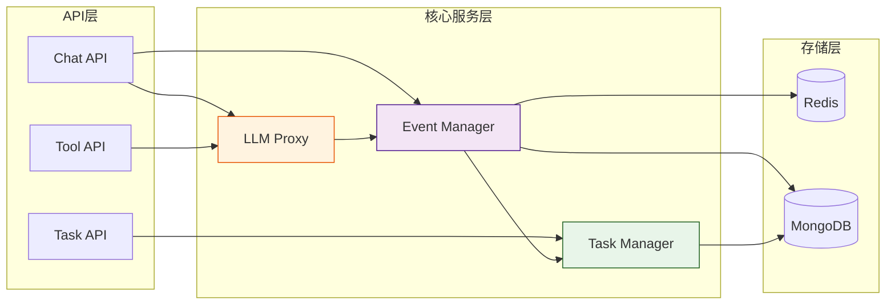

```mermaid
graph LR
    subgraph "API层"
        ChatAPI[Chat API]
        ToolAPI[Tool API]
        TaskAPI[Task API]
    end

    subgraph "核心服务层"
        LLMProxy[LLM Proxy]
        EventMgr[Event Manager]
        TaskMgr[Task Manager]
    end

    subgraph "存储层"
        Redis[(Redis)]
        MongoDB[(MongoDB)]
    end

    ChatAPI --> EventMgr
    ChatAPI --> LLMProxy
    ToolAPI --> LLMProxy
    TaskAPI --> TaskMgr

    LLMProxy --> EventMgr
    EventMgr --> TaskMgr
    EventMgr --> Redis
    EventMgr --> MongoDB
    TaskMgr --> MongoDB

    style LLMProxy fill:#fff3e0,stroke:#e65100
    style EventMgr fill:#f3e5f5,stroke:#4a148c
    style TaskMgr fill:#e8f5e9,stroke:#1b5e20
```