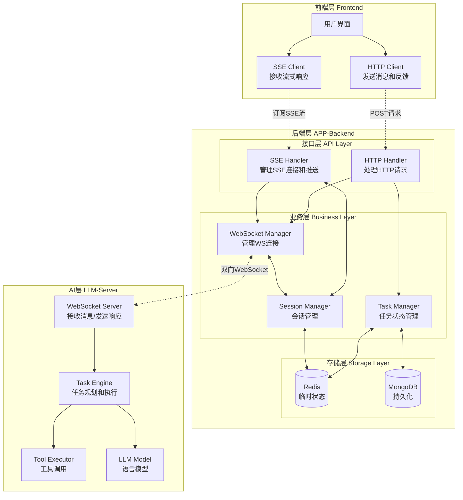

```mermaid
graph TB
    subgraph "前端层 Frontend"
        UI[用户界面]
        SSE_C[SSE Client<br/>接收流式响应]
        HTTP_C[HTTP Client<br/>发送消息和反馈]
    end
    
    subgraph "后端层 APP-Backend"
        direction TB
        
        subgraph "接口层 API Layer"
            SSE_H[SSE Handler<br/>管理SSE连接和推送]
            HTTP_H[HTTP Handler<br/>处理HTTP请求]
        end
        
        subgraph "业务层 Business Layer"
            WS_M[WebSocket Manager<br/>管理WS连接]
            Task_M[Task Manager<br/>任务状态管理]
            Session_M[Session Manager<br/>会话管理]
        end
        
        subgraph "存储层 Storage Layer"
            Redis[(Redis<br/>临时状态)]
            Mongo[(MongoDB<br/>持久化)]
        end
    end
    
    subgraph "AI层 LLM-Server"
        WS_S[WebSocket Server<br/>接收消息/发送响应]
        Task_E[Task Engine<br/>任务规划和执行]
        Tool_Ex[Tool Executor<br/>工具调用]
        Model[LLM Model<br/>语言模型]
    end
    
    UI --> SSE_C
    UI --> HTTP_C
    
    SSE_C -.订阅SSE流.-> SSE_H
    HTTP_C -.POST请求.-> HTTP_H
    
    SSE_H <--> Session_M
    HTTP_H --> Task_M
    HTTP_H --> WS_M
    
    SSE_H --> WS_M
    WS_M <--> Session_M
    Task_M <--> Redis
    Task_M <--> Mongo
    Session_M <--> Redis
    
    WS_M <-.双向WebSocket.-> WS_S
    WS_S --> Task_E
    Task_E --> Tool_Ex
    Task_E --> Model
```