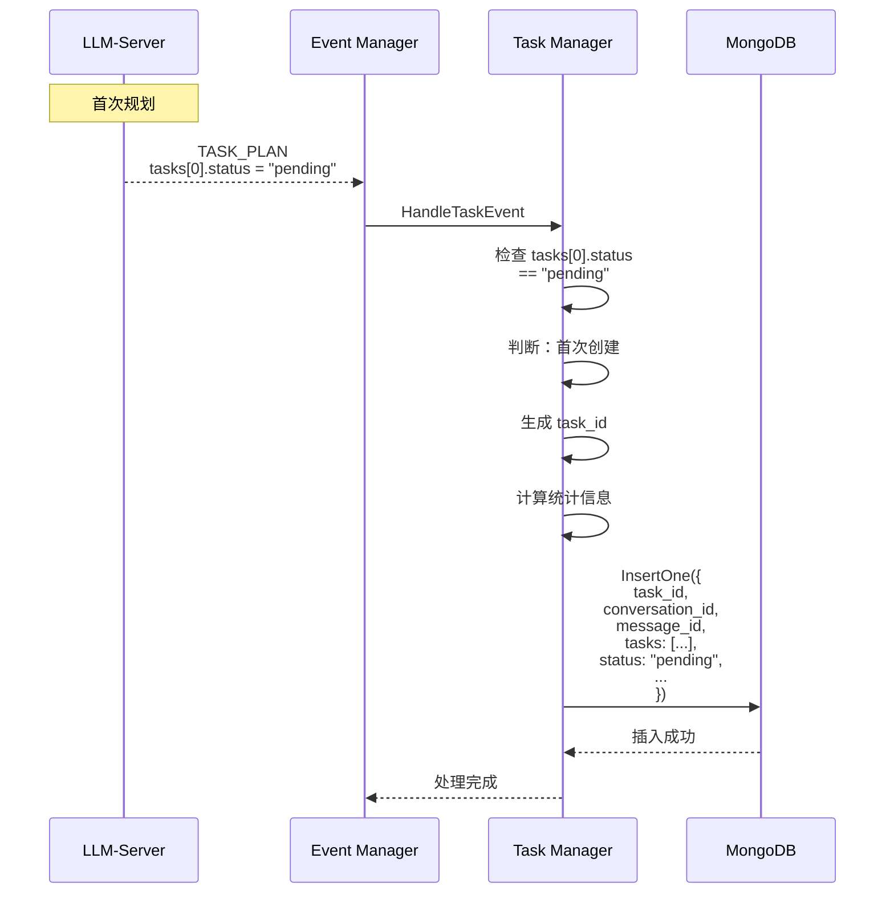

```mermaid
sequenceDiagram
    participant LLM as LLM-Server
    participant EM as Event Manager
    participant TM as Task Manager
    participant DB as MongoDB
    
    Note over LLM: 首次规划
    
    LLM-->>EM: TASK_PLAN<br/>tasks[0].status = "pending"
    
    EM->>TM: HandleTaskEvent
    
    TM->>TM: 检查 tasks[0].status<br/>== "pending"
    
    TM->>TM: 判断：首次创建
    
    TM->>TM: 生成 task_id
    
    TM->>TM: 计算统计信息
    
    TM->>DB: InsertOne({<br/>  task_id,<br/>  conversation_id,<br/>  message_id,<br/>  tasks: [...],<br/>  status: "pending",<br/>  ...<br/>})
    
    DB-->>TM: 插入成功
    
    TM-->>EM: 处理完成
```