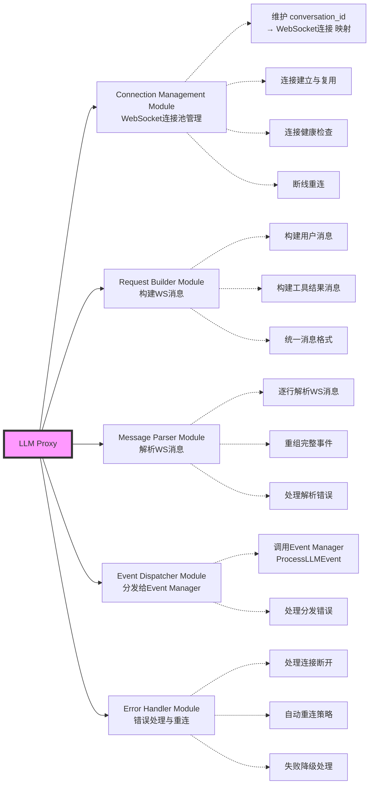

```mermaid
graph LR
    LP[LLM Proxy]
    
    LP --> CMM[Connection Management Module<br/>WebSocket连接池管理]
    LP --> RBM[Request Builder Module<br/>构建WS消息]
    LP --> MPM[Message Parser Module<br/>解析WS消息]
    LP --> EDM[Event Dispatcher Module<br/>分发给Event Manager]
    LP --> EHM[Error Handler Module<br/>错误处理与重连]
    
    CMM -.-> CMM1[维护 conversation_id<br/>→ WebSocket连接 映射]
    CMM -.-> CMM2[连接建立与复用]
    CMM -.-> CMM3[连接健康检查]
    CMM -.-> CMM4[断线重连]
    
    RBM -.-> RBM1[构建用户消息]
    RBM -.-> RBM2[构建工具结果消息]
    RBM -.-> RBM3[统一消息格式]
    
    MPM -.-> MPM1[逐行解析WS消息]
    MPM -.-> MPM2[重组完整事件]
    MPM -.-> MPM3[处理解析错误]
    
    EDM -.-> EDM1[调用Event Manager<br/>ProcessLLMEvent]
    EDM -.-> EDM2[处理分发错误]
    
    EHM -.-> EHM1[处理连接断开]
    EHM -.-> EHM2[自动重连策略]
    EHM -.-> EHM3[失败降级处理]
    
    style LP fill:#f9f,stroke:#333,stroke-width:4px
```