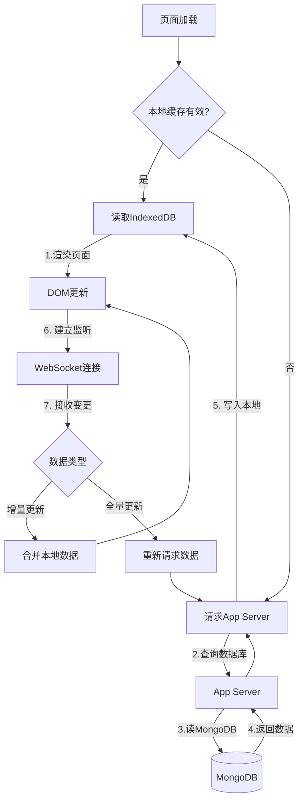

```mermaid
graph TD
    A[页面加载] --> B{本地缓存有效?}
    B -->|是| C[读取IndexedDB]
    B -->|否| D[请求App Server]
    C -->|1.渲染页面| E[DOM更新]
    D -->|2.查询数据库| F[App Server]
    F -->|3.读MongoDB| G[(MongoDB)]
    G -->|4.返回数据| F --> D
    D -->|5. 写入本地| C
    E -->|6. 建立监听| H[WebSocket连接]
    H -->|7. 接收变更| I{数据类型}
    I -->|增量更新| J[合并本地数据]
    I -->|全量更新| K[重新请求数据]
    J --> E
    K --> D
```