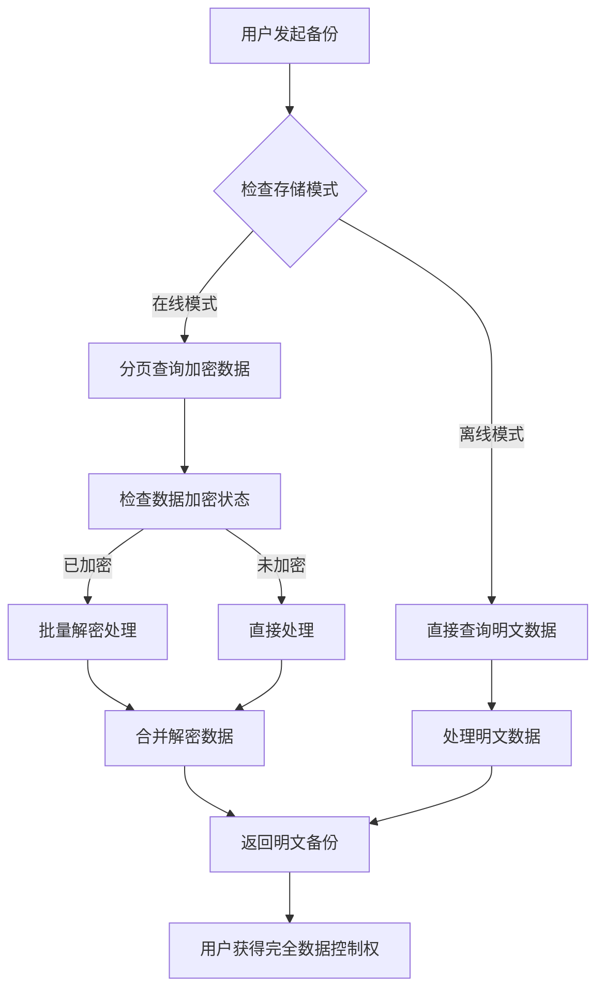

```mermaid
flowchart TD
    A[用户发起备份] --> B{检查存储模式}
    
    B -->|在线模式| C[分页查询加密数据]
    B -->|离线模式| D[直接查询明文数据]
    
    C --> E[检查数据加密状态]
    E -->|已加密| F[批量解密处理]
    E -->|未加密| G[直接处理]
    
    F --> H[合并解密数据]
    G --> H
    D --> I[处理明文数据]
    
    H --> J[返回明文备份]
    I --> J
    
    J --> K[用户获得完全数据控制权]
```