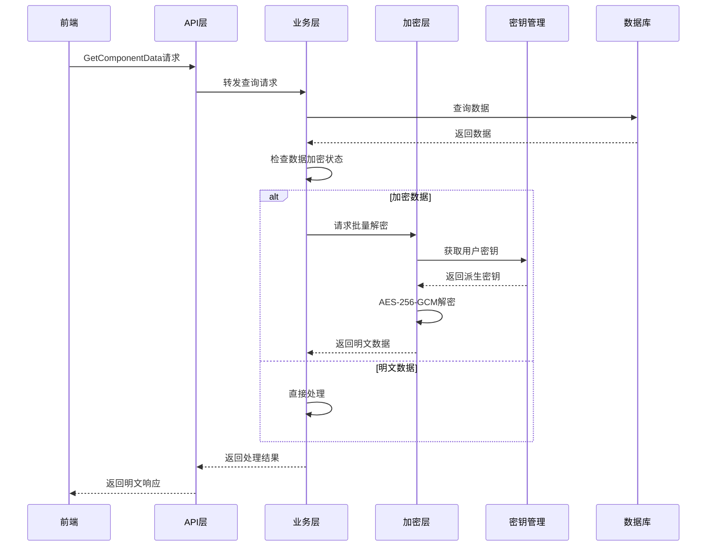

```mermaid
sequenceDiagram
    participant F as 前端
    participant A as API层
    participant B as 业务层
    participant E as 加密层
    participant K as 密钥管理
    participant D as 数据库
    
    F->>A: GetComponentData请求
    A->>B: 转发查询请求
    B->>D: 查询数据
    D-->>B: 返回数据
    
    B->>B: 检查数据加密状态
    
    alt 加密数据
        B->>E: 请求批量解密
        E->>K: 获取用户密钥
        K-->>E: 返回派生密钥
        E->>E: AES-256-GCM解密
        E-->>B: 返回明文数据
    else 明文数据
        B->>B: 直接处理
    end
    
    B-->>A: 返回处理结果
    A-->>F: 返回明文响应
```