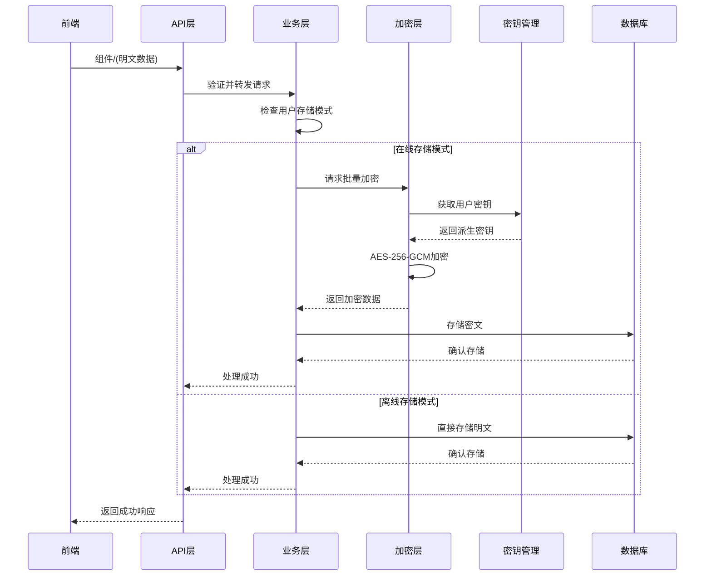

```mermaid
sequenceDiagram
    participant F as 前端
    participant A as API层
    participant B as 业务层
    participant E as 加密层
    participant K as 密钥管理
    participant D as 数据库
    
    F->>A: 组件/(明文数据)
    A->>B: 验证并转发请求
    B->>B: 检查用户存储模式
    
    alt 在线存储模式
        B->>E: 请求批量加密
        E->>K: 获取用户密钥
        K-->>E: 返回派生密钥
        E->>E: AES-256-GCM加密
        E-->>B: 返回加密数据
        B->>D: 存储密文
        D-->>B: 确认存储
        B-->>A: 处理成功
    else 离线存储模式
        B->>D: 直接存储明文
        D-->>B: 确认存储
        B-->>A: 处理成功
    end
    
    A-->>F: 返回成功响应
```