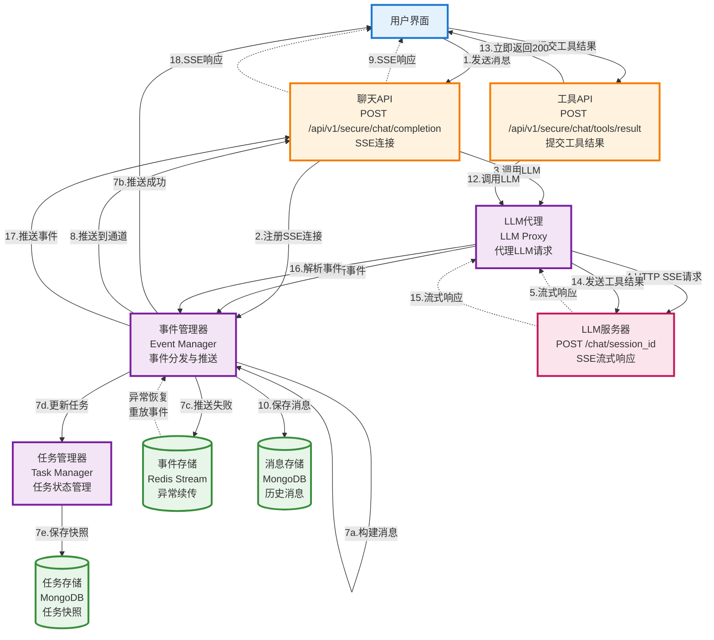

```mermaid
graph TB
    %% ========== 节点定义 ==========
    
    %% 前端层
    UI[用户界面]
    
    %% API层
    ChatAPI[聊天API<br/>POST /api/v1/secure/chat/completion<br/>SSE连接]
    ToolAPI[工具API<br/>POST /api/v1/secure/chat/tools/result<br/>提交工具结果]
    
    %% 核心服务层
    EventMgr[事件管理器<br/>Event Manager<br/>事件分发与推送]
    TaskMgr[任务管理器<br/>Task Manager<br/>任务状态管理]
    LLMProxy[LLM代理<br/>LLM Proxy<br/>代理LLM请求]
    
    %% 存储层
    EventStore[(事件存储<br/>Redis Stream<br/>异常续传)]
    TaskStore[(任务存储<br/>MongoDB<br/>任务快照)]
    MessageStore[(消息存储<br/>MongoDB<br/>历史消息)]
    
    %% LLM服务
    LLMAPI[LLM服务器<br/>POST /chat/session_id<br/>SSE流式响应]
    
    %% ========== 主流程：用户发送消息 ==========
    
    UI -->|1.发送消息| ChatAPI
    ChatAPI -->|2.注册SSE连接| EventMgr
    ChatAPI -->|3.调用LLM| LLMProxy
    
    LLMProxy -->|4.HTTP SSE请求| LLMAPI
    LLMAPI -.->|5.流式响应| LLMProxy
    
    LLMProxy -->|6.解析事件| EventMgr
    EventMgr -->|7a.构建消息| EventMgr
    EventMgr -->|7b.推送成功| UI
    EventMgr -->|7c.推送失败| EventStore
    EventMgr -->|7d.更新任务| TaskMgr
    
    TaskMgr -->|7e.保存快照| TaskStore
    EventMgr -->|8.推送到通道| ChatAPI
    ChatAPI -.->|9.SSE响应| UI
    EventMgr -->|10.保存消息| MessageStore
    
    %% ========== 工具调用流程 ==========
    
    UI -->|11.提交工具结果| ToolAPI
    ToolAPI -->|12.调用LLM| LLMProxy
    ToolAPI -->|13.立即返回200| UI
    
    LLMProxy -->|14.发送工具结果| LLMAPI
    LLMAPI -.->|15.流式响应| LLMProxy
    LLMProxy -->|16.解析事件| EventMgr
    EventMgr -->|17.推送事件| ChatAPI
    ChatAPI -.->|18.SSE响应| UI
    
    %% ========== 续传流程 ==========
    
    EventStore -.->|异常恢复<br/>重放事件| EventMgr
    
    %% ========== 样式定义 ==========
    
    classDef frontend fill:#E3F2FD,stroke:#1976D2,stroke-width:3px
    classDef api fill:#FFF3E0,stroke:#F57C00,stroke-width:3px
    classDef service fill:#F3E5F5,stroke:#7B1FA2,stroke-width:3px
    classDef storage fill:#E8F5E9,stroke:#388E3C,stroke-width:3px
    classDef llm fill:#FCE4EC,stroke:#C2185B,stroke-width:3px
    
    class UI frontend
    class ChatAPI,ToolAPI api
    class EventMgr,TaskMgr,LLMProxy service
    class EventStore,TaskStore,MessageStore storage
    class LLMAPI llm
```