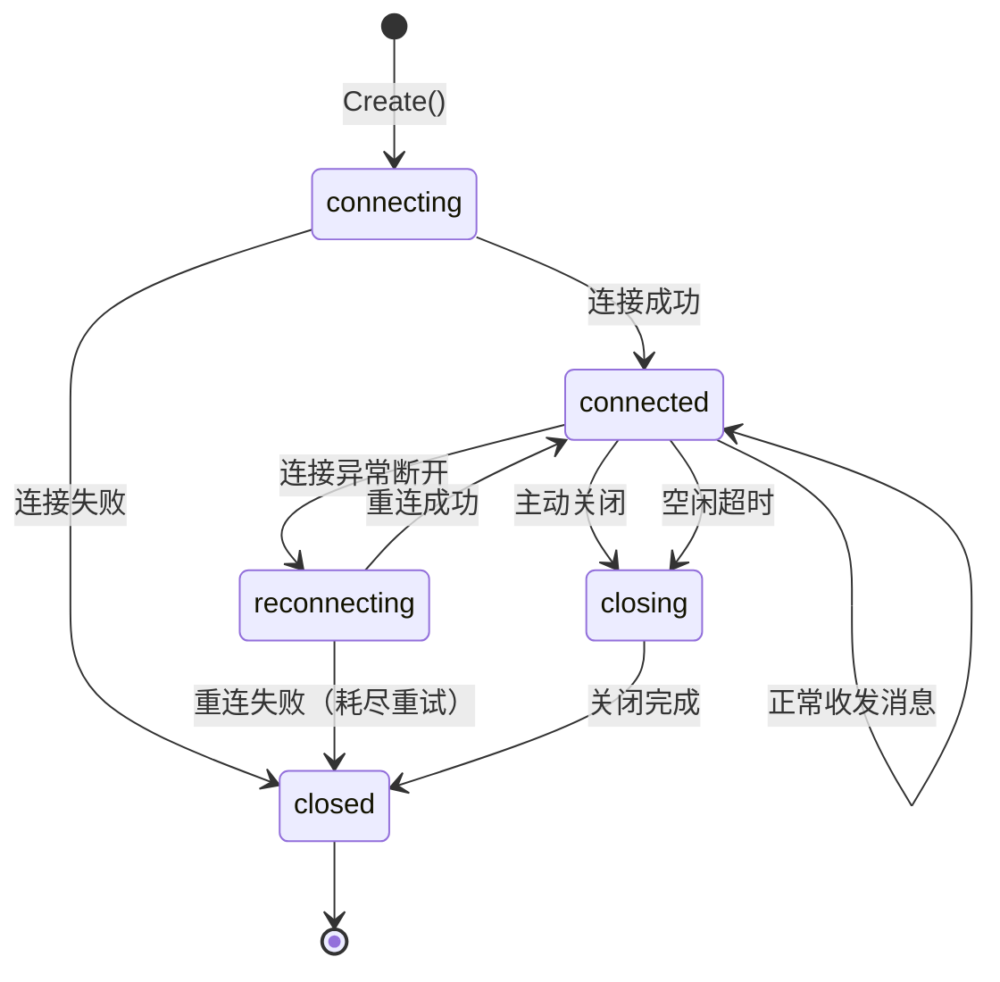

```mermaid
stateDiagram-v2
    [*] --> connecting: Create()
    connecting --> connected: 连接成功
    connecting --> closed: 连接失败
    
    connected --> connected: 正常收发消息
    connected --> reconnecting: 连接异常断开
    connected --> closing: 主动关闭
    connected --> closing: 空闲超时
    
    reconnecting --> connected: 重连成功
    reconnecting --> closed: 重连失败（耗尽重试）
    
    closing --> closed: 关闭完成
    
    closed --> [*]
```