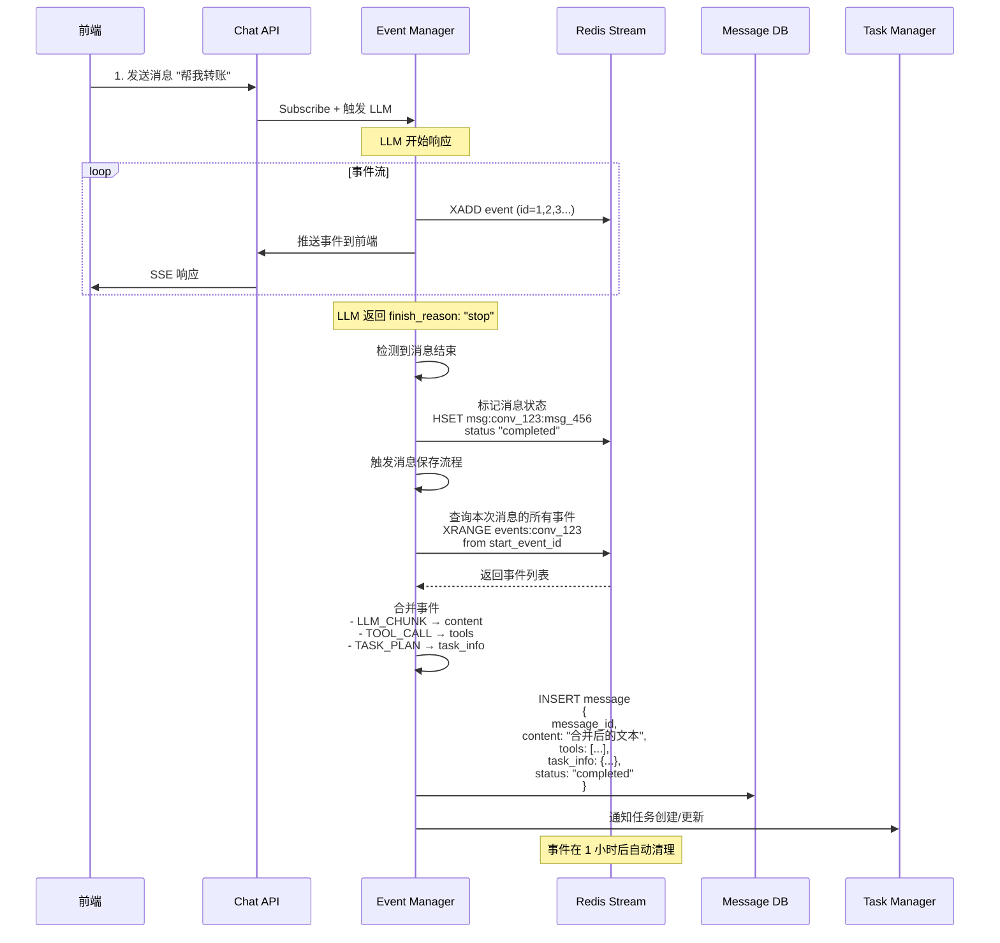

```mermaid
sequenceDiagram
    participant FE as 前端
    participant API as Chat API
    participant EM as Event Manager
    participant Redis as Redis Stream
    participant MsgDB as Message DB
    participant TaskMgr as Task Manager
    
    FE->>API: 1. 发送消息 "帮我转账"
    API->>EM: Subscribe + 触发 LLM
    
    Note over EM: LLM 开始响应
    
    loop 事件流
        EM->>Redis: XADD event (id=1,2,3...)
        EM->>API: 推送事件到前端
        API->>FE: SSE 响应
    end
    
    Note over EM: LLM 返回 finish_reason: "stop"
    
    EM->>EM: 检测到消息结束
    EM->>Redis: 标记消息状态<br/>HSET msg:conv_123:msg_456<br/>status "completed"
    
    EM->>EM: 触发消息保存流程
    
    EM->>Redis: 查询本次消息的所有事件<br/>XRANGE events:conv_123<br/>from start_event_id
    
    Redis-->>EM: 返回事件列表
    
    EM->>EM: 合并事件<br/>- LLM_CHUNK → content<br/>- TOOL_CALL → tools<br/>- TASK_PLAN → task_info
    
    EM->>MsgDB: INSERT message<br/>{<br/>  message_id,<br/>  content: "合并后的文本",<br/>  tools: [...],<br/>  task_info: {...},<br/>  status: "completed"<br/>}
    
    EM->>TaskMgr: 通知任务创建/更新
    
    Note over Redis: 事件在 1 小时后自动清理
```