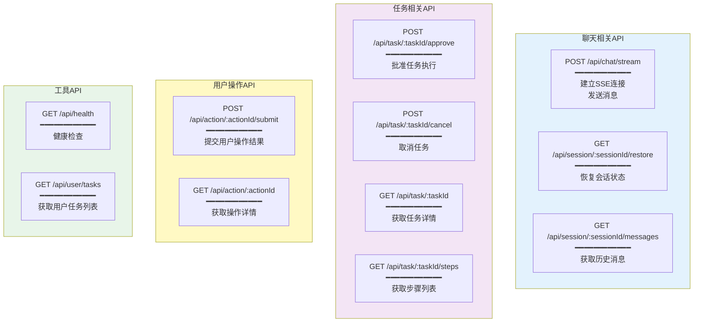

```mermaid
graph TB
    subgraph ChatAPIs["聊天相关API"]
        API1["POST /api/chat/stream<br/>━━━━━━━━━━━━<br/>建立SSE连接<br/>发送消息"]
        API2["GET /api/session/:sessionId/restore<br/>━━━━━━━━━━━━<br/>恢复会话状态"]
        API3["GET /api/session/:sessionId/messages<br/>━━━━━━━━━━━━<br/>获取历史消息"]
    end
    
    subgraph TaskAPIs["任务相关API"]
        API4["POST /api/task/:taskId/approve<br/>━━━━━━━━━━━━<br/>批准任务执行"]
        API5["POST /api/task/:taskId/cancel<br/>━━━━━━━━━━━━<br/>取消任务"]
        API6["GET /api/task/:taskId<br/>━━━━━━━━━━━━<br/>获取任务详情"]
        API7["GET /api/task/:taskId/steps<br/>━━━━━━━━━━━━<br/>获取步骤列表"]
    end
    
    subgraph ActionAPIs["用户操作API"]
        API8["POST /api/action/:actionId/submit<br/>━━━━━━━━━━━━<br/>提交用户操作结果"]
        API9["GET /api/action/:actionId<br/>━━━━━━━━━━━━<br/>获取操作详情"]
    end
    
    subgraph UtilAPIs["工具API"]
        API10["GET /api/health<br/>━━━━━━━━━━━━<br/>健康检查"]
        API11["GET /api/user/tasks<br/>━━━━━━━━━━━━<br/>获取用户任务列表"]
    end
    
    style ChatAPIs fill:#e3f2fd
    style TaskAPIs fill:#f3e5f5
    style ActionAPIs fill:#fff9c4
    style UtilAPIs fill:#e8f5e9
```