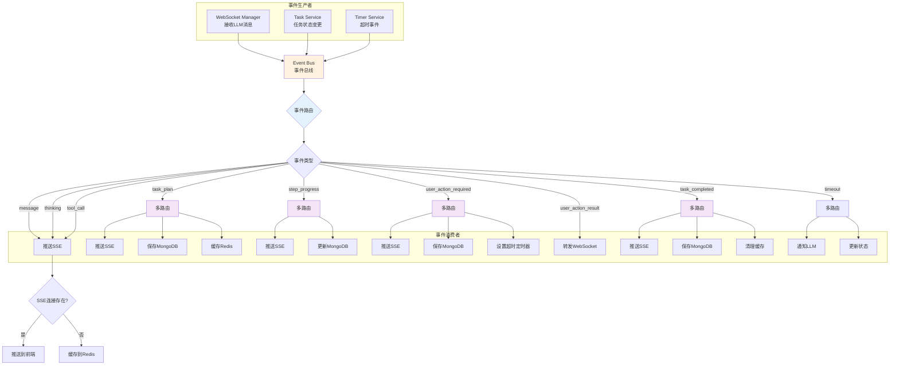

```mermaid
graph TB
    subgraph Producers["事件生产者"]
        P1[WebSocket Manager<br/>接收LLM消息]
        P2[Task Service<br/>任务状态变更]
        P3[Timer Service<br/>超时事件]
    end
    
    P1 --> EventBus
    P2 --> EventBus
    P3 --> EventBus
    
    EventBus[Event Bus<br/>事件总线]
    
    EventBus --> Router{事件路由}
    
    Router --> CheckType{事件类型}
    
    CheckType -->|message| SSE1[推送SSE]
    CheckType -->|thinking| SSE1
    CheckType -->|tool_call| SSE1
    
    CheckType -->|task_plan| MultiRoute1[多路由]
    MultiRoute1 --> SSE2[推送SSE]
    MultiRoute1 --> DB1[保存MongoDB]
    MultiRoute1 --> Cache1[缓存Redis]
    
    CheckType -->|step_progress| MultiRoute2[多路由]
    MultiRoute2 --> SSE3[推送SSE]
    MultiRoute2 --> DB2[更新MongoDB]
    
    CheckType -->|user_action_required| MultiRoute3[多路由]
    MultiRoute3 --> SSE4[推送SSE]
    MultiRoute3 --> DB3[保存MongoDB]
    MultiRoute3 --> Timer[设置超时定时器]
    
    CheckType -->|user_action_result| WS1[转发WebSocket]
    
    CheckType -->|task_completed| MultiRoute4[多路由]
    MultiRoute4 --> SSE5[推送SSE]
    MultiRoute4 --> DB4[保存MongoDB]
    MultiRoute4 --> Clear[清理缓存]
    
    CheckType -->|timeout| MultiRoute5[多路由]
    MultiRoute5 --> WS2[通知LLM]
    MultiRoute5 --> DB5[更新状态]
    
    subgraph Consumers["事件消费者"]
        SSE1
        SSE2
        SSE3
        SSE4
        SSE5
        DB1
        DB2
        DB3
        DB4
        DB5
        WS1
        WS2
        Cache1
        Timer
        Clear
    end
    
    SSE1 --> CheckConn{SSE连接存在?}
    CheckConn -->|是| Push[推送到前端]
    CheckConn -->|否| Cache2[缓存到Redis]
    
    style EventBus fill:#fff3e0
    style Router fill:#e3f2fd
    style MultiRoute1 fill:#f3e5f5
    style MultiRoute2 fill:#f3e5f5
    style MultiRoute3 fill:#f3e5f5
    style MultiRoute4 fill:#f3e5f5
```