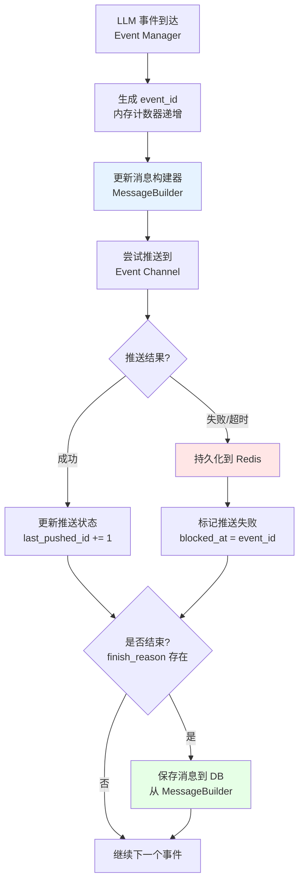

```mermaid
graph TB
    Start[LLM 事件到达<br/>Event Manager]
    
    Start --> Generate[生成 event_id<br/>内存计数器递增]
    
    Generate --> Build[更新消息构建器<br/>MessageBuilder]
    
    Build --> TryPush[尝试推送到<br/>Event Channel]
    
    TryPush --> PushResult{推送结果?}
    
    PushResult -->|成功| UpdateState[更新推送状态<br/>last_pushed_id += 1]
    
    PushResult -->|失败/超时| Persist[持久化到 Redis]
    
    Persist --> MarkFailed[标记推送失败<br/>blocked_at = event_id]
    
    UpdateState --> CheckFinish{是否结束?<br/>finish_reason 存在}
    MarkFailed --> CheckFinish
    
    CheckFinish -->|是| SaveMsg[保存消息到 DB<br/>从 MessageBuilder]
    CheckFinish -->|否| Done[继续下一个事件]
    
    SaveMsg --> Done
    
    style Build fill:#e6f3ff
    style Persist fill:#ffe6e6
    style SaveMsg fill:#e6ffe6
```