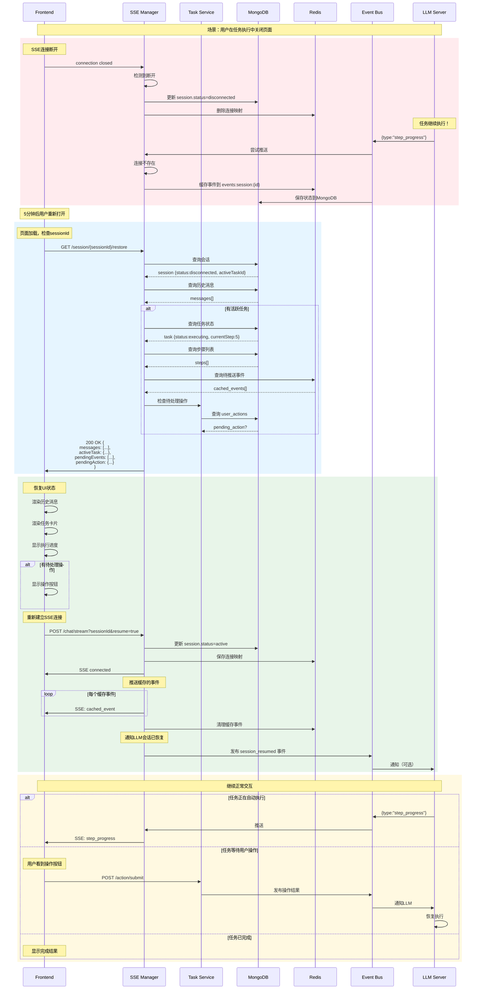

```mermaid
sequenceDiagram
    participant F as Frontend
    participant SSE as SSE Manager
    participant TS as Task Service
    participant DB as MongoDB
    participant Redis as Redis
    participant EB as Event Bus
    participant L as LLM Server

    Note over F,L: 场景：用户在任务执行中关闭页面
    
    rect rgb(255, 235, 238)
        Note over F: SSE连接断开
        F->>SSE: connection closed
        SSE->>SSE: 检测到断开
        SSE->>DB: 更新 session.status=disconnected
        SSE->>Redis: 删除连接映射
        
        Note over L: 任务继续执行！
        L->>EB: {type:"step_progress"}
        EB->>SSE: 尝试推送
        SSE->>SSE: 连接不存在
        SSE->>Redis: 缓存事件到 events:session:{id}
        EB->>DB: 保存状态到MongoDB
    end
    
    Note over F: 5分钟后用户重新打开
    
    rect rgb(230, 245, 255)
        Note over F: 页面加载，检查sessionId
        F->>SSE: GET /session/{sessionId}/restore
        SSE->>DB: 查询会话
        DB-->>SSE: session {status:disconnected, activeTaskId}
        
        SSE->>DB: 查询历史消息
        DB-->>SSE: messages[]
        
        alt 有活跃任务
            SSE->>DB: 查询任务状态
            DB-->>SSE: task {status:executing, currentStep:5}
            
            SSE->>DB: 查询步骤列表
            DB-->>SSE: steps[]
            
            SSE->>Redis: 查询待推送事件
            Redis-->>SSE: cached_events[]
            
            SSE->>TS: 检查待处理操作
            TS->>DB: 查询 user_actions
            DB-->>TS: pending_action?
        end
        
        SSE->>F: 200 OK {<br/>  messages: [...],<br/>  activeTask: {...},<br/>  pendingEvents: [...],<br/>  pendingAction: {...}<br/>}
    end
    
    rect rgb(232, 245, 233)
        Note over F: 恢复UI状态
        F->>F: 渲染历史消息
        F->>F: 渲染任务卡片
        F->>F: 显示执行进度
        
        alt 有待处理操作
            F->>F: 显示操作按钮
        end
        
        Note over F: 重新建立SSE连接
        F->>SSE: POST /chat/stream?sessionId&resume=true
        SSE->>DB: 更新 session.status=active
        SSE->>Redis: 保存连接映射
        SSE->>F: SSE connected
        
        Note over SSE: 推送缓存的事件
        loop 每个缓存事件
            SSE->>F: SSE: cached_event
        end
        
        SSE->>Redis: 清理缓存事件
        
        Note over SSE: 通知LLM会话已恢复
        SSE->>EB: 发布 session_resumed 事件
        EB->>L: 通知（可选）
    end
    
    rect rgb(255, 249, 225)
        Note over F,L: 继续正常交互
        
        alt 任务正在自动执行
            L->>EB: {type:"step_progress"}
            EB->>SSE: 推送
            SSE->>F: SSE: step_progress
            
        else 任务等待用户操作
            Note over F: 用户看到操作按钮
            F->>TS: POST /action/submit
            TS->>EB: 发布操作结果
            EB->>L: 通知LLM
            L->>L: 恢复执行
            
        else 任务已完成
            Note over F: 显示完成结果
        end
    end
```