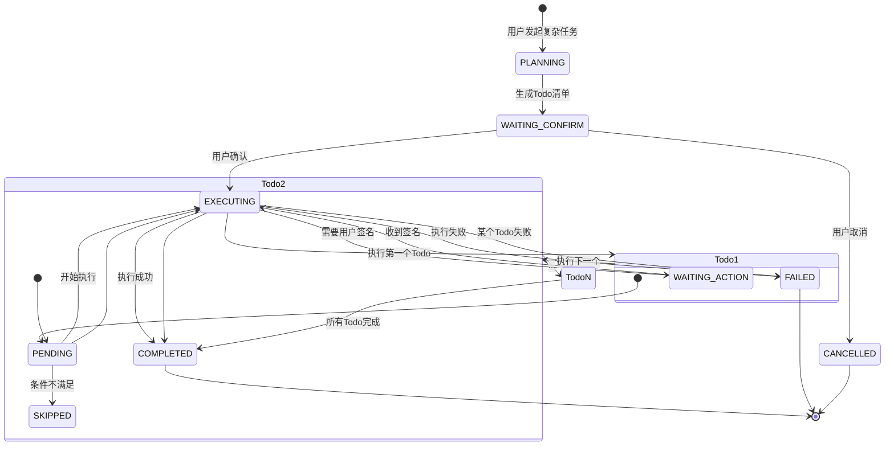

```mermaid
stateDiagram-v2
    [*] --> PLANNING: 用户发起复杂任务
    PLANNING --> WAITING_CONFIRM: 生成Todo清单
    WAITING_CONFIRM --> EXECUTING: 用户确认
    WAITING_CONFIRM --> CANCELLED: 用户取消
    
    EXECUTING --> Todo1: 执行第一个Todo
    
    state Todo1 {
        [*] --> PENDING
        PENDING --> EXECUTING: 开始执行
        EXECUTING --> WAITING_ACTION: 需要用户签名
        WAITING_ACTION --> EXECUTING: 收到签名
        EXECUTING --> COMPLETED: 执行成功
        EXECUTING --> FAILED: 执行失败
    }
    
    Todo1 --> Todo2: 执行下一个
    
    state Todo2 {
        [*] --> PENDING
        PENDING --> SKIPPED: 条件不满足
        PENDING --> EXECUTING
        EXECUTING --> COMPLETED
    }
    
    Todo2 --> TodoN: ...
    TodoN --> COMPLETED: 所有Todo完成
    
    EXECUTING --> FAILED: 某个Todo失败
    COMPLETED --> [*]
    FAILED --> [*]
    CANCELLED --> [*]
```