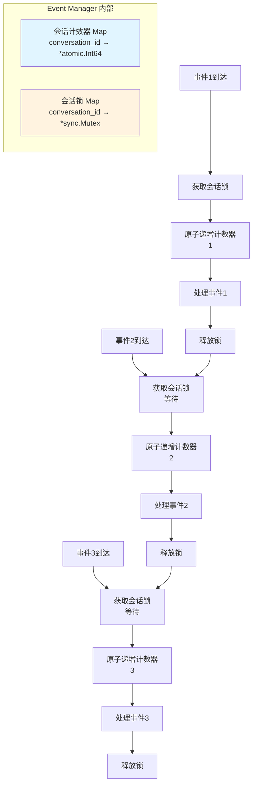

```mermaid
graph TB
    subgraph "Event Manager 内部"
        Counter[会话计数器 Map<br/>conversation_id → *atomic.Int64]
        Lock[会话锁 Map<br/>conversation_id → *sync.Mutex]
    end
    
    Event1[事件1到达]
    Event2[事件2到达]
    Event3[事件3到达]
    
    Event1 --> GetLock1[获取会话锁]
    GetLock1 --> Inc1[原子递增计数器<br/>1]
    Inc1 --> Process1[处理事件1]
    Process1 --> Release1[释放锁]
    
    Event2 --> GetLock2[获取会话锁<br/>等待]
    Release1 --> GetLock2
    GetLock2 --> Inc2[原子递增计数器<br/>2]
    Inc2 --> Process2[处理事件2]
    Process2 --> Release2[释放锁]
    
    Event3 --> GetLock3[获取会话锁<br/>等待]
    Release2 --> GetLock3
    GetLock3 --> Inc3[原子递增计数器<br/>3]
    Inc3 --> Process3[处理事件3]
    Process3 --> Release3[释放锁]
    
    style Counter fill:#e1f5ff
    style Lock fill:#fff3e0
```