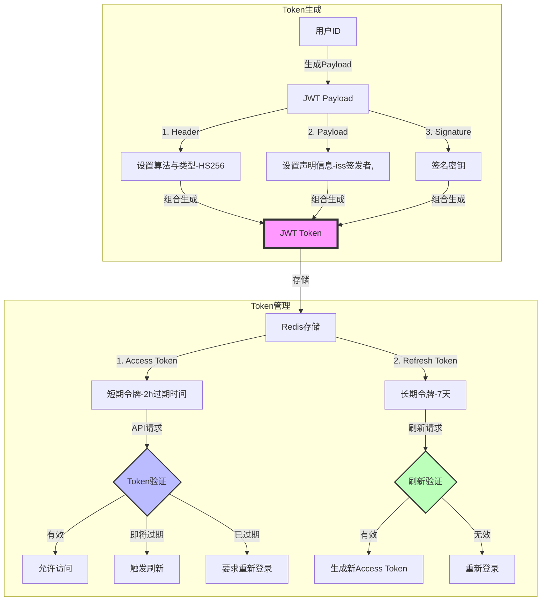

```mermaid

flowchart TD
    subgraph Token生成
        A[用户ID] -->|生成Payload| B[JWT Payload]
        B -->|1. Header| C[设置算法与类型-HS256]
        B -->|2. Payload| D[设置声明信息-iss签发者,]
        B -->|3. Signature| E[签名密钥]
        C & D & E -->|组合生成| F[JWT Token]
    end


    subgraph Token管理
        F -->|存储| G[Redis存储]
        G -->|1. Access Token| H[短期令牌-2h过期时间]
        G -->|2. Refresh Token| I[长期令牌-7天]
        
        H -->|API请求| J{Token验证}
        J -->|有效| K[允许访问]
        J -->|即将过期| L[触发刷新]
        J -->|已过期| M[要求重新登录]
        
        I -->|刷新请求| N{刷新验证}
        N -->|有效| O[生成新Access Token]
        N -->|无效| P[重新登录]
    end

    style F fill:#f9f,stroke:#333,stroke-width:4px
    style J fill:#bbf,stroke:#333,stroke-width:2px
    style N fill:#bfb,stroke:#333,stroke-width:2px

```