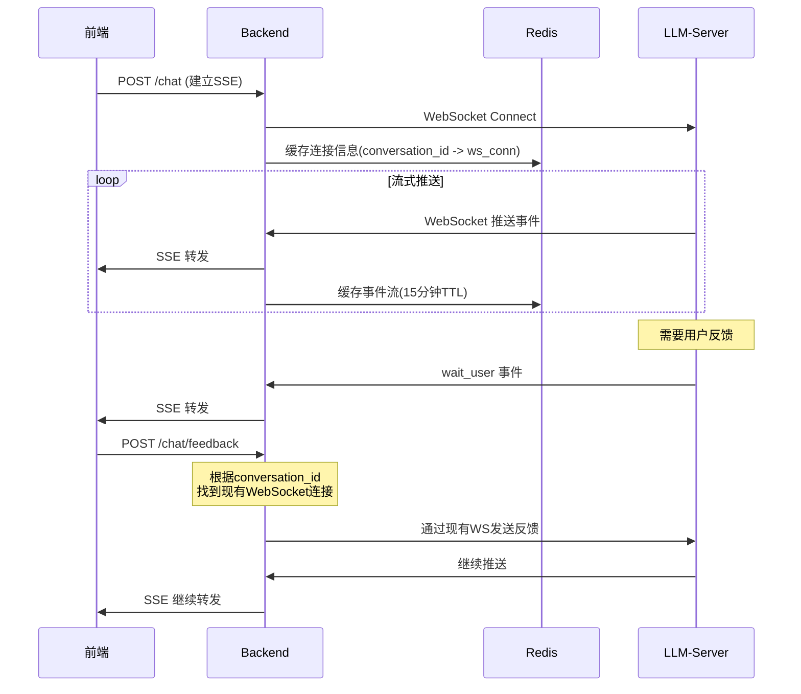

```mermaid
sequenceDiagram
    participant F as 前端
    participant B as Backend
    participant R as Redis
    participant L as LLM-Server
    
    F->>B: POST /chat (建立SSE)
    B->>L: WebSocket Connect
    B->>R: 缓存连接信息(conversation_id -> ws_conn)
    
    loop 流式推送
        L->>B: WebSocket 推送事件
        B->>F: SSE 转发
        B->>R: 缓存事件流(15分钟TTL)
    end
    
    Note over L: 需要用户反馈
    L->>B: wait_user 事件
    B->>F: SSE 转发
    
    F->>B: POST /chat/feedback
    Note over B: 根据conversation_id<br/>找到现有WebSocket连接
    B->>L: 通过现有WS发送反馈
    
    L->>B: 继续推送
    B->>F: SSE 继续转发
```