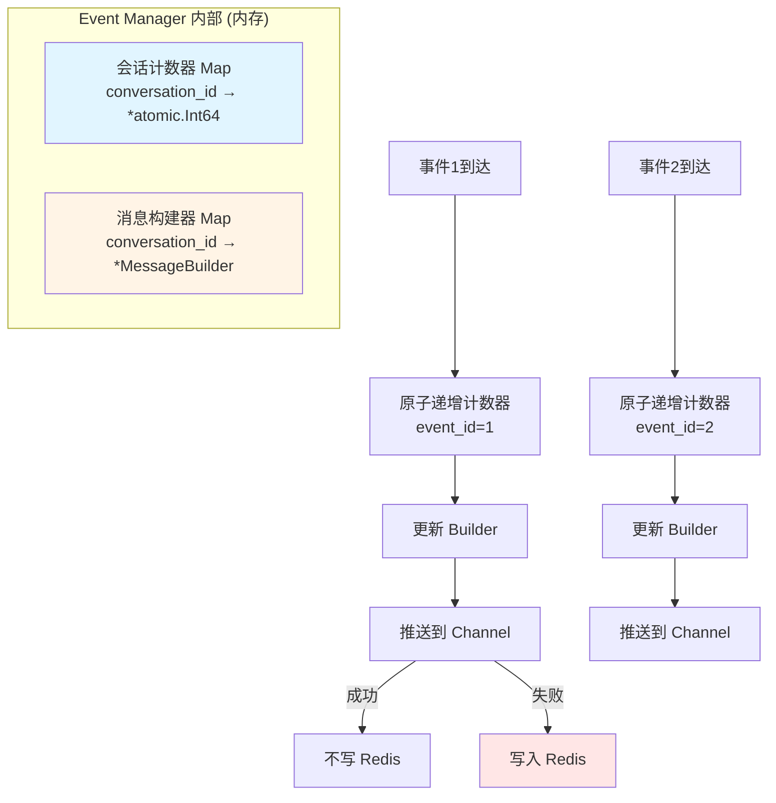

```mermaid
graph TB
    subgraph "Event Manager 内部 (内存)"
        Counter[会话计数器 Map<br/>conversation_id → *atomic.Int64]
        Builder[消息构建器 Map<br/>conversation_id → *MessageBuilder]
    end
    
    Event1[事件1到达]
    Event2[事件2到达]
    
    Event1 --> Inc1[原子递增计数器<br/>event_id=1]
    Inc1 --> Update1[更新 Builder]
    Update1 --> Push1[推送到 Channel]
    
    Push1 -->|成功| Direct1[不写 Redis]
    Push1 -->|失败| ToRedis1[写入 Redis]
    
    Event2 --> Inc2[原子递增计数器<br/>event_id=2]
    Inc2 --> Update2[更新 Builder]
    Update2 --> Push2[推送到 Channel]
    
    style Counter fill:#e1f5ff
    style Builder fill:#fff4e6
    style ToRedis1 fill:#ffe6e6
```