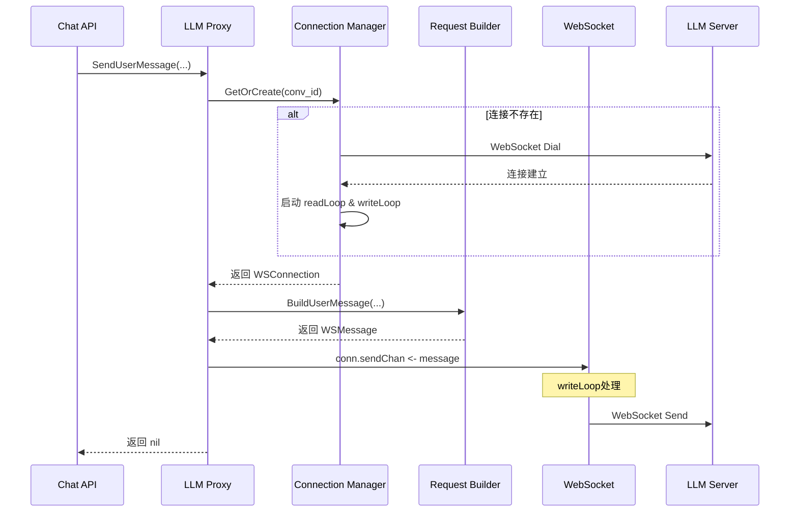

```mermaid
sequenceDiagram
    participant API as Chat API
    participant Proxy as LLM Proxy
    participant ConnMgr as Connection Manager
    participant Builder as Request Builder
    participant WS as WebSocket
    participant LLM as LLM Server

    API->>Proxy: SendUserMessage(...)
    Proxy->>ConnMgr: GetOrCreate(conv_id)
    
    alt 连接不存在
        ConnMgr->>LLM: WebSocket Dial
        LLM-->>ConnMgr: 连接建立
        ConnMgr->>ConnMgr: 启动 readLoop & writeLoop
    end
    
    ConnMgr-->>Proxy: 返回 WSConnection
    
    Proxy->>Builder: BuildUserMessage(...)
    Builder-->>Proxy: 返回 WSMessage
    
    Proxy->>WS: conn.sendChan <- message
    
    Note over WS: writeLoop处理
    WS->>LLM: WebSocket Send
    
    Proxy-->>API: 返回 nil
```