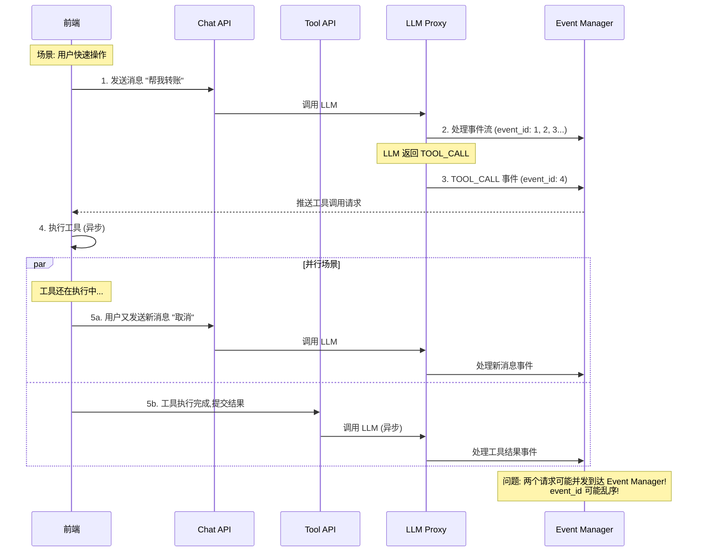

```mermaid
sequenceDiagram
    participant FE as 前端
    participant ChatAPI as Chat API
    participant ToolAPI as Tool API
    participant LLMProxy as LLM Proxy
    participant EM as Event Manager
    
    Note over FE: 场景: 用户快速操作
    
    FE->>ChatAPI: 1. 发送消息 "帮我转账"
    ChatAPI->>LLMProxy: 调用 LLM
    
    LLMProxy->>EM: 2. 处理事件流 (event_id: 1, 2, 3...)
    
    Note over LLMProxy: LLM 返回 TOOL_CALL
    LLMProxy->>EM: 3. TOOL_CALL 事件 (event_id: 4)
    EM-->>FE: 推送工具调用请求
    
    FE->>FE: 4. 执行工具 (异步)
    
    par 并行场景
        Note over FE: 工具还在执行中...
        FE->>ChatAPI: 5a. 用户又发送新消息 "取消"
        ChatAPI->>LLMProxy: 调用 LLM
        LLMProxy->>EM: 处理新消息事件
    and
        FE->>ToolAPI: 5b. 工具执行完成,提交结果
        ToolAPI->>LLMProxy: 调用 LLM (异步)
        LLMProxy->>EM: 处理工具结果事件
    end
    
    Note over EM: 问题: 两个请求可能并发到达 Event Manager!<br/>event_id 可能乱序!
```