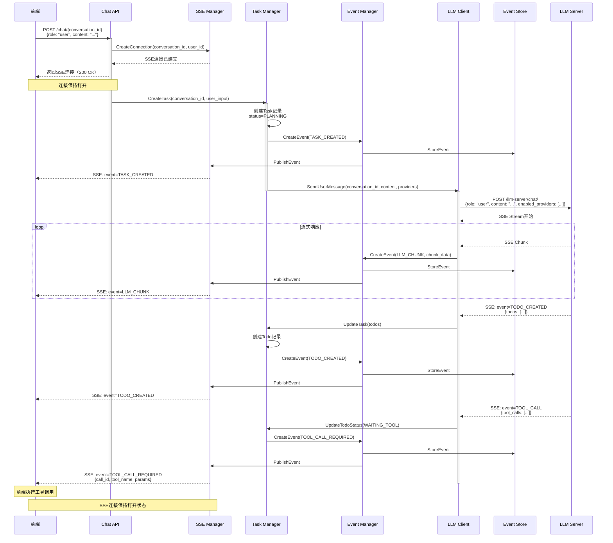

```mermaid
sequenceDiagram
    participant FE as 前端
    participant ChatAPI as Chat API
    participant SSEMgr as SSE Manager
    participant TaskMgr as Task Manager
    participant EventMgr as Event Manager
    participant LLMClient as LLM Client
    participant EventStore as Event Store
    participant LLM as LLM Server

    FE->>ChatAPI: POST /chat/{conversation_id}<br/>{role: "user", content: "..."}
    
    activate ChatAPI
    ChatAPI->>SSEMgr: CreateConnection(conversation_id, user_id)
    SSEMgr-->>ChatAPI: SSE连接已建立
    ChatAPI-->>FE: 返回SSE连接（200 OK）
    Note over FE,ChatAPI: 连接保持打开
    
    ChatAPI->>TaskMgr: CreateTask(conversation_id, user_input)
    activate TaskMgr
    TaskMgr->>TaskMgr: 创建Task记录<br/>status=PLANNING
    TaskMgr->>EventMgr: CreateEvent(TASK_CREATED)
    EventMgr->>EventStore: StoreEvent
    EventMgr->>SSEMgr: PublishEvent
    SSEMgr-->>FE: SSE: event=TASK_CREATED
    
    TaskMgr->>LLMClient: SendUserMessage(conversation_id, content, providers)
    deactivate TaskMgr
    
    activate LLMClient
    LLMClient->>LLM: POST /llm-server/chat/<br/>{role: "user", content: "...", enabled_providers: [...]}
    
    LLM-->>LLMClient: SSE Stream开始
    
    loop 流式响应
        LLM-->>LLMClient: SSE Chunk
        LLMClient->>EventMgr: CreateEvent(LLM_CHUNK, chunk_data)
        EventMgr->>EventStore: StoreEvent
        EventMgr->>SSEMgr: PublishEvent
        SSEMgr-->>FE: SSE: event=LLM_CHUNK
    end
    
    LLM-->>LLMClient: SSE: event=TODO_CREATED<br/>{todos: [...]}
    LLMClient->>TaskMgr: UpdateTask(todos)
    TaskMgr->>TaskMgr: 创建Todo记录
    TaskMgr->>EventMgr: CreateEvent(TODO_CREATED)
    EventMgr->>EventStore: StoreEvent
    EventMgr->>SSEMgr: PublishEvent
    SSEMgr-->>FE: SSE: event=TODO_CREATED
    
    LLM-->>LLMClient: SSE: event=TOOL_CALL<br/>{tool_calls: [...]}
    LLMClient->>TaskMgr: UpdateTodoStatus(WAITING_TOOL)
    TaskMgr->>EventMgr: CreateEvent(TOOL_CALL_REQUIRED)
    EventMgr->>EventStore: StoreEvent
    EventMgr->>SSEMgr: PublishEvent
    SSEMgr-->>FE: SSE: event=TOOL_CALL_REQUIRED<br/>{call_id, tool_name, params}
    
    deactivate LLMClient
    deactivate ChatAPI
    
    Note over FE: 前端执行工具调用
    Note over FE,SSEMgr: SSE连接保持打开状态
```