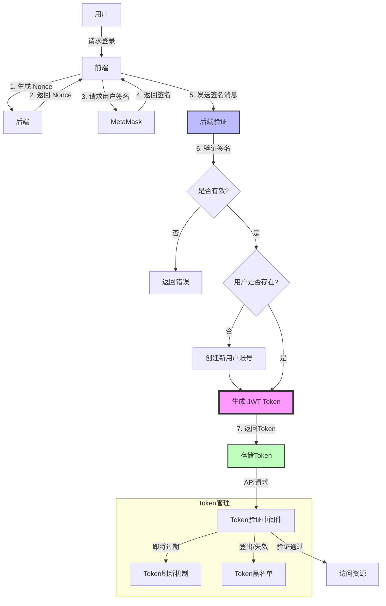

```mermaid
flowchart TD
    A[用户] -->|请求登录| B[前端]
    B -->|1. 生成 Nonce| C[后端]
    C -->|2. 返回 Nonce| B
    B -->|3. 请求用户签名| D[MetaMask]
    D -->|4. 返回签名| B
    B -->|5. 发送签名消息| E[后端验证]
    
    E -->|6. 验证签名| F{是否有效?}
    F -->|否| G[返回错误]
    F -->|是| H{用户是否存在?}
    
    H -->|否| I[创建新用户账号]
    I -->J[生成 JWT Token]
    H -->|是| J
    
    J -->|7. 返回Token| K[存储Token]
    
    subgraph Token管理
        L[Token验证中间件]
        M[Token刷新机制]
        N[Token黑名单]
    end
    
    K -->|API请求| L
    L -->|验证通过| O[访问资源]
    L -->|即将过期| M
    L -->|登出/失效| N

    style J fill:#f9f,stroke:#333,stroke-width:4px
    style E fill:#bbf,stroke:#333,stroke-width:2px
    style K fill:#bfb,stroke:#333,stroke-width:2px
```