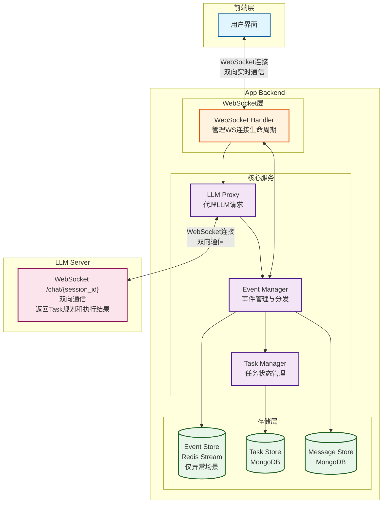

```mermaid
graph TB
  subgraph "前端层"
    UI[用户界面]
  end

  subgraph "App Backend"
    direction TB

    subgraph "WebSocket层"
      WSHandler["WebSocket Handler<br/>管理WS连接生命周期"]
    end

    subgraph "核心服务"
      EventMgr["Event Manager<br/>事件管理与分发"]
      TaskMgr["Task Manager<br/>任务状态管理"]
      LLMProxy["LLM Proxy<br/>代理LLM请求"]
    end

    subgraph "存储层"
      EventStore[("Event Store<br/>Redis Stream<br/>仅异常场景")]
      TaskStore[("Task Store<br/>MongoDB")]
      MessageStore[("Message Store<br/>MongoDB")]
    end
  end

  subgraph "LLM Server"
    LLMWS["WebSocket /chat/{session_id}<br/>双向通信<br/>返回Task规划和执行结果"]
  end

  UI <-->|"WebSocket连接<br/>双向实时通信"| WSHandler
  WSHandler <--> EventMgr
  WSHandler --> LLMProxy
  
  LLMProxy <-->|"WebSocket连接<br/>双向通信"| LLMWS
  
  LLMProxy --> EventMgr
  EventMgr --> TaskMgr
  EventMgr --> EventStore
  EventMgr --> MessageStore
  TaskMgr --> TaskStore

  classDef frontend fill:#e1f5ff,stroke:#01579b,stroke-width:2px
  classDef ws fill:#fff3e0,stroke:#e65100,stroke-width:2px
  classDef service fill:#f3e5f5,stroke:#4a148c,stroke-width:2px
  classDef storage fill:#e8f5e9,stroke:#1b5e20,stroke-width:2px
  classDef llm fill:#fce4ec,stroke:#880e4f,stroke-width:2px

  class UI frontend
  class WSHandler ws
  class EventMgr,TaskMgr,LLMProxy service
  class EventStore,TaskStore,MessageStore storage
  class LLMWS llm
```