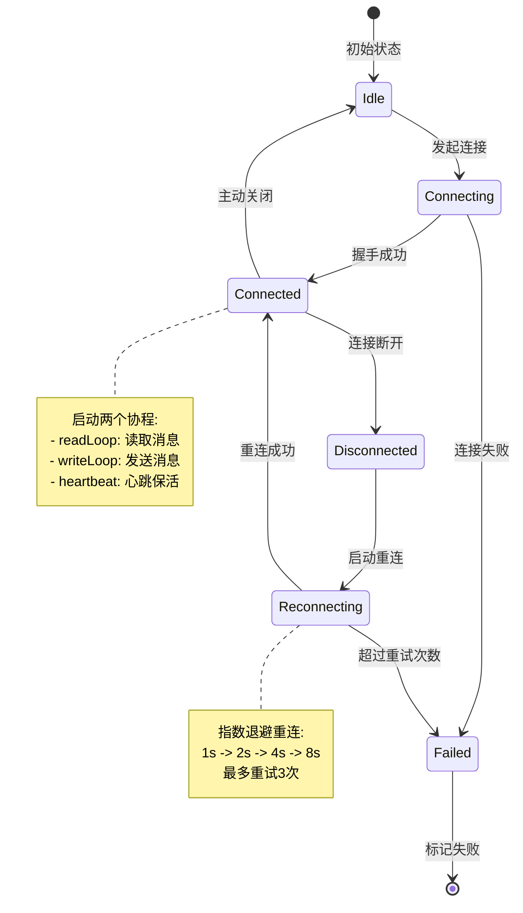

```mermaid
stateDiagram-v2
    [*] --> Idle: 初始状态
    Idle --> Connecting: 发起连接
    Connecting --> Connected: 握手成功
    Connecting --> Failed: 连接失败
    Connected --> Disconnected: 连接断开
    Connected --> Idle: 主动关闭
    Disconnected --> Reconnecting: 启动重连
    Reconnecting --> Connected: 重连成功
    Reconnecting --> Failed: 超过重试次数
    Failed --> [*]: 标记失败
    
    note right of Connected
        启动两个协程:
        - readLoop: 读取消息
        - writeLoop: 发送消息
        - heartbeat: 心跳保活
    end note
    
    note right of Reconnecting
        指数退避重连:
        1s -> 2s -> 4s -> 8s
        最多重试3次
    end note
```