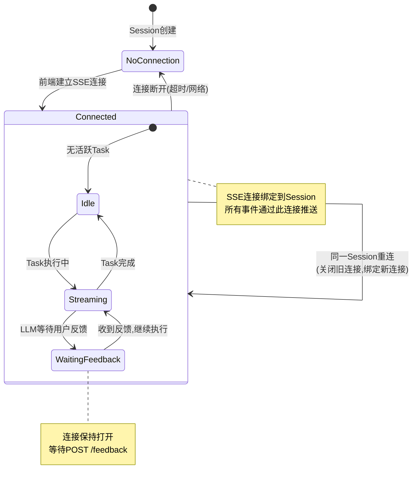

```mermaid
stateDiagram-v2
    [*] --> NoConnection: Session创建
    
    NoConnection --> Connected: 前端建立SSE连接
    Connected --> NoConnection: 连接断开(超时/网络)
    Connected --> Connected: 同一Session重连<br/>(关闭旧连接,绑定新连接)
    
    state Connected {
        [*] --> Idle: 无活跃Task
        Idle --> Streaming: Task执行中
        Streaming --> WaitingFeedback: LLM等待用户反馈
        WaitingFeedback --> Streaming: 收到反馈,继续执行
        Streaming --> Idle: Task完成
    }
    
    note right of Connected
        SSE连接绑定到Session
        所有事件通过此连接推送
    end note
    
    note right of WaitingFeedback
        连接保持打开
        等待POST /feedback
    end note
```