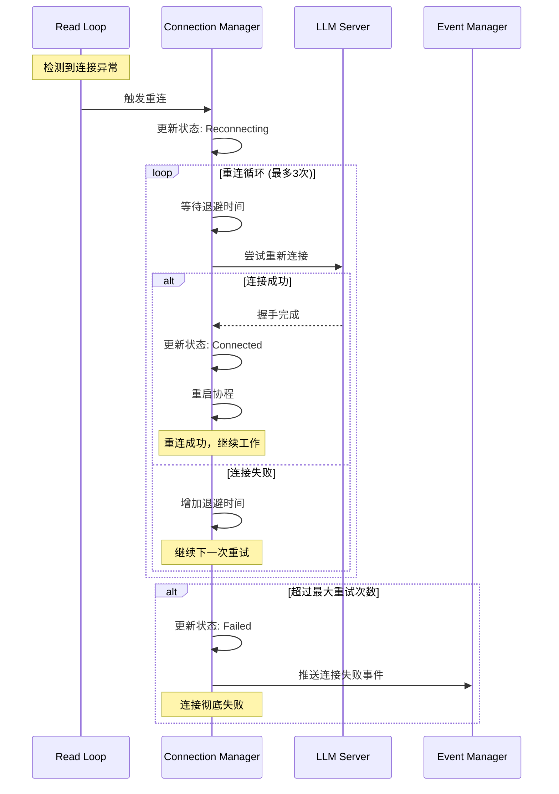

```mermaid
sequenceDiagram
    participant ReadLoop as Read Loop
    participant ConnMgr as Connection Manager
    participant LLM as LLM Server
    participant EM as Event Manager
    
    Note over ReadLoop: 检测到连接异常
    ReadLoop->>ConnMgr: 触发重连
    ConnMgr->>ConnMgr: 更新状态: Reconnecting
    
    loop 重连循环 (最多3次)
        ConnMgr->>ConnMgr: 等待退避时间
        ConnMgr->>LLM: 尝试重新连接
        
        alt 连接成功
            LLM-->>ConnMgr: 握手完成
            ConnMgr->>ConnMgr: 更新状态: Connected
            ConnMgr->>ConnMgr: 重启协程
            Note over ConnMgr: 重连成功，继续工作
        else 连接失败
            ConnMgr->>ConnMgr: 增加退避时间
            Note over ConnMgr: 继续下一次重试
        end
    end
    
    alt 超过最大重试次数
        ConnMgr->>ConnMgr: 更新状态: Failed
        ConnMgr->>EM: 推送连接失败事件
        Note over ConnMgr: 连接彻底失败
    end
```